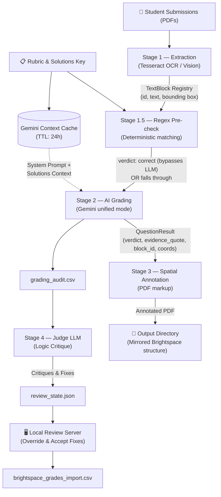

# Gemini-Backed Brightspace Grader

[](https://github.com/walshkang/gradeline/actions/workflows/test.yml)

This tool grades Brightspace PDF submissions with Gemini, annotates PDFs with movable/editable FreeText annotations (green checks/red `x` marks), and builds CSV outputs for grade import and review.

It is specifically optimized for instructors using **D2L Brightspace** who download PDF submissions and want a repeatable, profile-based grading workflow with a built-in review web app. It natively understands Brightspace's "Download All" ZIP structure, auto-detects `OrgDefinedId` or usernames, and outputs import-ready CSVs that match the Brightspace gradebook format.

## You’ll need

- A Brightspace course with at least one PDF-based assignment
- A Google Gemini API key
- macOS or Linux
- Python 3.11+ and the dependencies from `requirements.txt`

## Quick Start

```bash
# 1. Activate the virtual environment
source .venv/bin/activate

# 2. Set your Gemini API key (or add to .env file)
export GEMINI_API_KEY="your_api_key_here"

# 3. Import your assignment files from Downloads into data/{profile}/
./gradeline import --profile a2x

# 4. Run the quickstart wizard for that assignment
./gradeline quickstart --profile a2
```

> **First time?** Download your student submissions, answer key PDF, and grade CSV from Brightspace into `~/Downloads`, then run `./gradeline import --profile a2`. See [`data/README.md`](data/README.md) for the expected `data/{profile}/` structure.

Running `./gradeline` with no arguments opens an interactive menu:

```
› quickstart        —  Auto-detect settings, grade, and review
  run               —  Grade submissions and launch review server
  regrade           —  Clear cache and re-run grading from scratch
  serve             —  Launch review server for existing results
  setup             —  Interactive profile setup wizard
  import            —  Copy recent Brightspace downloads into data/{profile}/
  spot-grade        —  Grade a single late submission PDF (no Brightspace ID required)
  configure-api-key —  Set or change GenAI API key (.env)
  list              —  List local workflow profiles
```

All commands can also be called directly:

```bash
./gradeline import --profile a2
./gradeline quickstart --profile a2
./gradeline run --profile a2
./gradeline regrade --profile a2
./gradeline serve --profile a2
./gradeline configure-api-key
./gradeline list
```

## Requirements

- macOS/Linux
- Python 3.11+
- Python dependencies:

```bash
python3 -m pip install -r requirements.txt
```

- Legacy mode only binaries (not needed for unified mode):
  - `pdftotext`, `pdfinfo`, `pdftoppm`, `tesseract`

## Environment

Set your Gemini API key:

```bash
export GEMINI_API_KEY="your_api_key_here"
```

Or create a local `.env` file in this repo root (auto-loaded by `grader.cli` and the workflow CLI):

```bash
GEMINI_API_KEY="your_api_key_here"
```

You can also configure or rotate this key interactively via the workflow TUI (applies to all profiles):

```bash
./gradeline          # open interactive menu
# then choose: configure-api-key
```

Or call the configuration command directly:

```bash
./gradeline configure-api-key
```

This command updates the `.env` file used by Gradeline processes; it does **not** export `GEMINI_API_KEY` into your shell environment. If other tools depend on `GEMINI_API_KEY` in the shell, continue to set it with `export GEMINI_API_KEY=...` as needed.

## Workflow CLI (Profile-Based)

Use workflow profiles to avoid long flag lists for repeated assignment runs. The `./gradeline` wrapper auto-activates the `.venv` and delegates to the workflow CLI.

At a high level:

1. Download submissions, solutions, and a grade template CSV from Brightspace into `~/Downloads`.
2. Use `./gradeline import --profile a2` to copy them into `data/a2/`.
3. Use `./gradeline quickstart --profile a2` to auto-detect paths, confirm settings, and write a reusable profile.
4. Use `./gradeline run --profile a2` (or `regrade`/`serve`) to repeat the workflow.

See [`data/README.md`](data/README.md) for examples of how to lay out `data/{profile}/`.

### 1) Quickstart (recommended)

```bash
./gradeline quickstart --profile a2
```

Quickstart behavior:
- Detects defaults from existing profile values, prior successful runs, and a bounded `~/Downloads` scan.
- Shows one confirmation table with optional field edits.
- Writes the profile to `.manual_runs/profiles/a2.toml`.
- Runs grading + review server immediately by default.

Write profile only (do not run yet):

```bash
./gradeline quickstart --profile a2 --no-run
```

If the rubric path does not exist, quickstart can generate a starter rubric and prints a concise checklist:
- update `scoring_rules` per question
- confirm `label_patterns` and `anchor_tokens`
- verify grading bands thresholds

### 2) Manual setup wizard (fallback)

```bash
./gradeline setup --profile a2
```

The wizard prompts for:
- submissions folder
- solutions PDF (right answers)
- rubric YAML path (and can generate a starter rubric file)
- Brightspace grade template CSV + grade column
- output directory and review host/port

### 3) Import from Downloads into data/{profile}/

```bash
./gradeline import --profile a2
```

Behavior:

- Scans `~/Downloads` (or `--downloads-dir`) for a recent Brightspace submissions folder, a solutions PDF, and a grade CSV.
- Optionally handles Brightspace ZIPs by extracting them before import.
- Copies or moves (with `--move`) those assets into `data/{profile}/submissions`, `data/{profile}/solutions.pdf`, and `data/{profile}/grades.csv`.
- Prints a clear preview of what will be copied where before making changes.

### 4) Run full workflow (grade + init + serve)

```bash
./gradeline run --profile a2
```

Behavior:
- Loads `.manual_runs/profiles/a2.toml`
- Runs grading with mapped flags
- Initializes review state
- Starts review server on the requested port, or next free port (`+1`, up to 25 attempts)
- If profile is missing (interactive terminal), CLI offers quickstart, setup, or abort

### 5) Regrade (clear cache and re-run)

```bash
# Full regrade — clears all cache, outputs, and review state
./gradeline regrade --profile a2

# Surgical per-question regrade (re-grades only q2 across all students)
./gradeline regrade --profile a2 --question q2

# Regrade specific students only
./gradeline regrade --profile a2 --student-filter "Kevin Swift|Shelly Marc"
```

Regrade behavior:
- Deletes local results cache entries (all, or matching `--student-filter` regex)
- Removes annotated PDF output folders
- Full regrade also clears CSV artifacts, diagnostics, and review state
- Re-runs grading with fresh Gemini API calls
- Launches review server when done

### 6) Keep Assignment 1 and Assignment 2 open side-by-side

Terminal A:

```bash
./gradeline serve --profile a1 --port 8765
```

Terminal B:

```bash
./gradeline run --profile a2
```

### 7) List profiles and state status

```bash
./gradeline list
```

The list view includes:
- profile name
- output directory
- rubric path
- review state status (`valid`, `missing`, or `invalid:<reason>`)

### Troubleshooting

- `Profile file not found`: confirm profile is under `.manual_runs/profiles/<name>.toml` or pass an explicit path.
- `Unknown keys in [grade]`: remove unsupported keys; profile validation is strict by design.
- `Review state invalid`: run `./gradeline run` once, or run `grader.review_cli init --output-dir ...` manually.
- `Requested grade column was not found`: ensure profile `grade_column` matches your Brightspace template header.
- Quickstart shows everything as `<missing>`:
  - Make sure your assignment files are either in `data/{profile}/` or in `~/Downloads`.
  - Try running `./gradeline import --profile {profile}` to populate `data/{profile}/` first.

## Documentation

- [`docs/runbook.md`](docs/runbook.md) — step-by-step operational guide: new assignment setup, re-runs, rubric iteration, performance tuning, troubleshooting

## How It Works

The core grading engine operates as a four-stage linear pipeline per submission, executed concurrently using thread pools.



### Stage 1 — Extraction (OCR / Vision)
Extracts raw text and spatial bounding boxes from student PDFs. Runs Tesseract OCR in TSV mode to generate a **block registry** containing `id`, `text`, and exact pixel coordinates. If confidence is too low (e.g., messy handwriting), a Gemini vision fallback (`extraction_model`) is employed. 

### Stage 1.5 — Regex Pre-check (Hybrid)
Evaluates extracted text against `expected_answers` from the rubric. If a regex perfectly matches, the pipeline assigns a `correct` verdict deterministically (`grading_source="regex"`), skipping the LLM entirely to save time and API costs.

### Stage 2 — Grading (AI Reasoning)
The core logic engine. The submission PDF is sent to the LLM (using Gemini's unified mode) with the block registry injected as XML in the system prompt. The LLM evaluates the answers against the rubric and returns structured JSON containing a `verdict`, `evidence_quote`, and a specific `block_id`.

### Stage 3 — Spatial Annotation
Places physical green checks (✓) and red marks (✗) onto a copy of the student's PDF. Resolves placement using a strict priority chain:
1. `block_id` — Maps back to the exact bounding box from Stage 1.
2. `model_coords` — Normalized X/Y coordinates provided by the LLM (handwritten fallback).
3. `local_anchor` — Regex search for question label tokens (e.g., "1a)").
4. `summary_fallback` — Appends unresolved marks to a text summary on page 1.

### Stage 4 — Judge LLM Auditing
An independent AI pass that evaluates the primary grader's `logic_analysis` and `evidence_quote` against the rubric. It operates strictly on the `grading_audit.csv` database. Approved critiques and fixes are injected into `review_state.json`.

### Architectural Guardrails & Key Decisions

**Fail-Closed Error Handling (Zero-Trust State Management)**
The pipeline never crashes on individual submission errors (corrupted PDFs, OCR failures, LLM schema violations). Instead, it catches the exception, flags the submission as `REVIEW_REQUIRED` (scoring it 0), saves a checkpoint, and gracefully proceeds.

**Context Caching for Answer Keys**
In `unified` mode, the `solutions.pdf` and base system instructions are uploaded to Gemini's Context Cache once per run. All grading calls reuse this cache, significantly reducing token consumption and latency.

**Dual Thread Pools**
Execution uses two separate thread pools drained by a single event loop:
- **Grading Pool:** Heavy API wait times (default concurrency: 8)
- **Annotation Pool:** CPU-bound PDF rendering (concurrency: 4)
This ensures fast submissions finish immediately while complex ones (handwriting retries) run in the background.

**Separation of Audit State and Review UI**
The Judge LLM and human reviewers do not mutate the raw `grading_audit.csv` directly. Overrides and AI fixes are injected into `review_state.json`, preserving a clean separation between the original AI run and post-grading manual/audit modifications.

---

## Direct CLI Usage

For advanced usage or scripting, you can bypass profiles and call the grading engine directly:

```bash
python3 -m grader.cli \
  --submissions-dir "/path/to/submissions" \
  --solutions-pdf "/path/to/solutions.pdf" \
  --rubric-yaml "/path/to/rubric.yaml" \
  --grades-template-csv "/path/to/template.csv" \
  --grade-column "Assignment 1 Points Grade" \
  --grading-mode unified \
  --model "gemma-4-31b-it" \
  --output-dir "/path/to/output"
```

Optional flags:

```bash
--plain                          # force plain text output (no Rich formatting)
--diagnostics-file "/custom/path/grading_diagnostics.json"
--grading-mode legacy            # use legacy OCR/text + optional locator pass
--grading-mode agent             # agentic mode: uses an external CLI agent for multi-step reasoning
--agent-type "gemini"            # choices: gemini (default), codex, claude
--locator-model "gemini-3-flash-preview"
--context-cache --context-cache-ttl-seconds 86400
--extract-blocks / --no-extract-blocks   # build block registry for spatial annotation (default: on)
--extraction-model "gemini-2.0-flash-001"  # model used for OCR fallback when Tesseract confidence is low
--concurrency 8                  # parallel grading workers (default from configs/defaults.toml)
--student-filter "Jane Doe"      # regex to grade specific students only
--dry-run                        # skip API calls, test annotation layout
--rate-limit / --no-rate-limit   # enforce thread-safe RPM/RPD limits (default: enabled)
--resume                         # resume grading run from local checkpoint
```

## Outputs

Inside `--output-dir`:

- Mirrored student submission folders with annotated PDFs (same names as originals)
- `brightspace_grades_import.csv`
- `grading_audit.csv` (includes a `grading_source` column indicating if the grade came from `llm` or `regex` pre-check)
- `review_queue.csv`
- `index_audit.csv`
- `grading_diagnostics.json` (unless overridden with `--diagnostics-file`)

## Manual Review Web App (Local)

After a grading run finishes, a local browser app launches for second-pass manual review. The review server is started automatically by `./gradeline run` and `./gradeline regrade`.

To start the review server manually:

```bash
./gradeline serve --profile a2
```

Then open the URL shown in the terminal (default `http://127.0.0.1:8765`).

Use the **Config** tab to inspect/update:
- solutions/rubric paths captured from the CLI run
- grade points mapping
- rubric thresholds (`check_plus_min`, `check_min`), `partial_credit`
- question label patterns and scoring rules

### Export reviewed artifacts

```bash
python3 -m grader.review_cli export --output-dir "/path/to/grading/output"
```

Reviewed artifacts are written into `output_dir/review/`:

- `review_state.json`
- `review_events.jsonl`
- `reviewed_pdfs/...`
- `grading_audit_reviewed.csv`
- `review_queue_reviewed.csv`
- `brightspace_grades_import_reviewed.csv`
- `review_decisions.json`

## Advanced Concepts & Notes

### Grading & Scoring Policies
- **Custom Dynamic Grading Bands**: You can define any arbitrary grading bands (like `10, 9, 8...`) in the Rubric YAML under `bands`. Gradeline evaluates them dynamically by sorted descending threshold, and numeric band names automatically map directly to the output points score without manual CLI flag mappings.
- **Rounding Error Forgiveness**: `rounding_error` verdicts are fully forgiven (score 1.0, same as `correct`). They appear as `✓ Q1 ≈` in green on annotated PDFs and as `≈` in the summary line so you can still see where they occurred.
- **Feedback Fallback Policy**: If the AI feedback contains third-person tokens or is too wordy, the system drops the LLM feedback and falls back to the rubric's `short_note_fail` rather than dropping the note entirely. This ensures that the student is never penalized without a descriptive failure reason.
- If any question is `needs_review`, the final band is automatically escalated to `REVIEW_REQUIRED` (which defaults to a blank/ungraded LMS export). This grading escalation is independent of the manual review workflow status (e.g., marking a submission "Reviewed/Done" in the UI does not bypass the grade-level `REVIEW_REQUIRED` escalation if unresolved questions remain).
- Grade points are configurable via CLI flags: `--check-plus-points`, `--check-points`, `--check-minus-points`, `--review-required-points`.

### Reliability & Error Handling
- **Fail-Closed Error Handling**: If a PDF is corrupted, text extraction fails, or the LLM returns an invalid schema, the pipeline catches the error, flags the submission as `REVIEW_REQUIRED` (with a score of 0), logs the failure, and gracefully proceeds to the next student without crashing.
- **Checkpoints**: Progress checkpoints are saved automatically on interrupts (Ctrl+C) or daily limit exhaustion, allowing you to resume seamlessly via `--resume` or the interactive menu. Checkpoints are automatically cleared upon successful completion of the grading run.
- **Rate Limiting**: Thread-safe sliding window RPM limits and daily RPD limits are enforced by default. If a daily limit is hit, grading exits with code `5` and saves a checkpoint.

### Execution Modes (`unified` vs `agent` vs `legacy`)
- `--grading-mode` defaults to `legacy` for phased rollout.
- In `unified` mode, grading and coordinate locating happen in one structured Gemini call.
- Unified mode uses Gemini context caching for `solutions.pdf` unless `--no-context-cache` is passed.
- In `unified` mode, `--locator-model` and `--ocr-char-threshold` are ignored with warnings.
- In `legacy` mode, `--locator-model` is optional; if set, model-provided PDF coordinates are used before local anchor fallback.
- In `agent` mode, the tool uses an installed CLI agent to perform multi-step reasoning. This is often more robust for complex or handwritten submissions.
  - `gemini` agent requires the `gemini` CLI.
  - `codex` agent requires the `codex` CLI.
  - `claude` agent requires the `claude` CLI (Claude Code).

### Output & Display
- `--dry-run` defaults to header-only annotation (no per-question x/✓ marks). Use `--annotate-dry-run-marks` for debug placement marks.
- Rich console output with section headings, colored bands, and progress bars is used automatically in interactive terminals; use `--plain` for deterministic text output.

## Running Tests

Gradeline contains both unit/workflow tests and automated E2E browser integration tests (using Playwright).

### Unit & Workflow Tests
To run the standard test suite:
```bash
source .venv/bin/activate
python3 -m pytest tests/ -x -q
```

### E2E / Browser Integration Tests
The manual review server dashboard has integration tests that require Playwright:
```bash
# 1. Install dev dependencies
source .venv/bin/activate
pip install -r requirements-dev.txt

# 2. Install Playwright browser binary (using mirror fallback for CDN issues if needed)
export PLAYWRIGHT_DOWNLOAD_HOST=https://npmmirror.com/mirrors/playwright
playwright install chromium

# 3. Run E2E tests
python3 -m pytest tests/test_review_ui.py -v
```

## AI Coding Sessions & Agent Guidance

If you are an AI assistant or agent opening a coding session or executing commands/tool calls in this workspace, please adhere to the following rules:

1. **Activate the Virtual Environment**: Always run the activation script before any other command:
   ```bash
   source .venv/bin/activate
   ```
2. **Use Python 3**: Always run python commands using `python3` explicitly rather than `python` (e.g., when executing scripts, running tests, or performing tool calls):
   ```bash
   source .venv/bin/activate && python3 -m pytest tests/ -x -q
   ```
3. **Follow Architectural Guardrails**: Read and comply with the core project invariants defined in [.agents/AGENTS.md](file:///Users/walsh.kang/Documents/GitHub/gradeline/.agents/AGENTS.md) (Grade Integrity, Feedback Integrity, Config Hierarchy).

