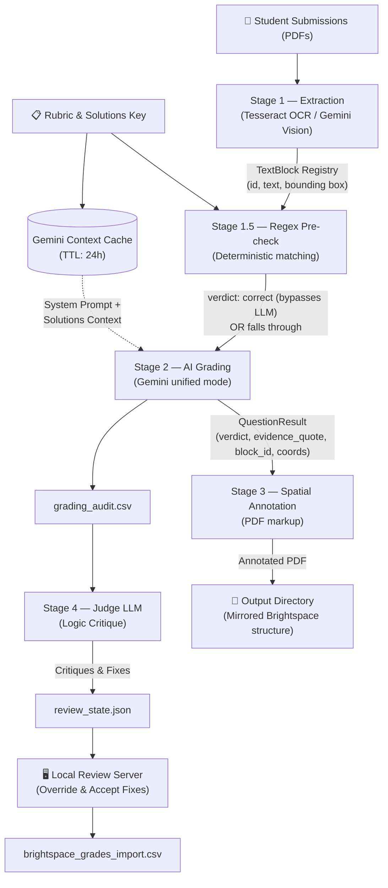

# Gradeline — Agent-Native & Verifiable PDF Grading Engine

[](https://github.com/walshkang/gradeline/actions/workflows/test.yml)

**Gradeline** is a CLI-native, fail-closed, spatial PDF grading engine powered by Google Gemini. Built specifically for instructors using **D2L Brightspace**, it automates assignment evaluation by combining deterministic pre-checks, spatial PDF visual annotations (green checks ✓ / red ✗ marks), Gemini context caching, and a local human-in-the-loop review app.

It natively handles Brightspace's "Download All" ZIP structure, matches student roster IDs (`OrgDefinedId`/`Username`), enforces zero-trust security guardrails, and outputs import-ready CSVs formatted for the Brightspace gradebook.

---

## Key Highlights

* **Deterministic Hybrid Pre-Check**: Utilizes regular expressions and an `expected_numeric` DSL to automatically grade exact numerical and percentage answers. Matching answers bypass LLM calls entirely, reducing API cost and latency.

* **Context Caching at Scale**: Uploads master solution keys and system instructions to Gemini Context Cache (24-hour TTL) once per batch, cutting input token costs by up to 90%.

* **Spatial PDF Grounding**: Stamps visual checks and error badges directly onto student PDFs at precise target coordinates using an exact priority fallback chain and collision detection.

* **Judge LLM Audit Pass**: Runs an independent secondary AI critique pass on `grading_audit.csv` to verify methodology on partial credit and rounding error verdicts.

* **Fail-Closed Zero-Trust Execution**: Corrupted PDFs or schema failures never crash the pipeline; problematic submissions automatically escalate to `REVIEW_REQUIRED` (score 0) while persisting progress checkpoints.

* **Agent-Native & Safe**: Includes structured exit codes (`0`, `3`, `4`, `5`), streaming `--json` telemetry, untrusted prompt XML isolation, and `.agents/AGENTS.md` repository guardrails for autonomous coding agents.

---

## Prerequisites

- macOS or Linux
- Python 3.11+
- A Google Gemini API key
- A Brightspace course with PDF-based assignments
- Python dependencies:

```bash
python3 -m pip install -r requirements.txt
```

- Legacy mode only binaries (not needed for unified mode):
  - `pdftotext`, `pdfinfo`, `pdftoppm`, `tesseract`

---

## Quick Start

```bash
# 1. Activate the virtual environment
source .venv/bin/activate

# 2. Set your Gemini API key (or configure via .env)
export GEMINI_API_KEY="your_api_key_here"

# 3. Import your Brightspace assignment download from ~/Downloads into data/a2/
./gradeline import --profile a2

# 4. Run the quickstart wizard to generate profile config, grade, and review
./gradeline quickstart --profile a2
```

> **First time?** Download student submissions, answer key PDF, and grade CSV into `~/Downloads`, then run `./gradeline import --profile a2`. See [`data/README.md`](data/README.md) for expected directory layouts.

### Interactive TUI Menu

Running `./gradeline` with no arguments launches the interactive terminal menu:

```
› quickstart        —  Auto-detect settings, grade, and launch review workstation
  run               —  Grade submissions and launch local review server
  regrade           —  Clear cache and re-run grading (full or per-question)
  serve             —  Launch review workstation for existing output results
  setup             —  Interactive step-by-step profile setup wizard
  import            —  Copy recent Brightspace downloads into data/{profile}/
  spot-grade        —  Grade a single late submission PDF
  audit-pdf         —  Zero-token visual annotation & layout health check
  configure-api-key —  Set or rotate GenAI API key in .env
  list              —  List local workflow profiles and state validation
```

All commands can be invoked directly via CLI:

```bash
./gradeline import --profile a2
./gradeline quickstart --profile a2
./gradeline run --profile a2
./gradeline regrade --profile a2
./gradeline serve --profile a2
./gradeline audit-pdf --profile a2
./gradeline configure-api-key
./gradeline list
```

---

## Environment Setup

Configure your Gemini API key via environment variable or `.env` file:

```bash
export GEMINI_API_KEY="your_api_key_here"
```

Or create a local `.env` file in this repo root (auto-loaded by `grader.cli` and the workflow CLI):

```bash
GEMINI_API_KEY="your_api_key_here"
```

Or configure key rotation interactively across all workflow profiles:

```bash
./gradeline configure-api-key
```

This command updates the `.env` file used by Gradeline processes; it does **not** export `GEMINI_API_KEY` into your shell environment. If other tools depend on `GEMINI_API_KEY` in the shell, continue to set it with `export GEMINI_API_KEY=...` as needed.

---

## Documentation

- [`docs/runbook.md`](docs/runbook.md) — step-by-step operational guide: new assignment setup, re-runs, rubric iteration, performance tuning, troubleshooting

---

## Architecture & Pipeline Execution

Gradeline executes a linear, four-stage spatial ETL (Extract, Transform, Load) pipeline per submission, executed concurrently using thread pools.



### Stage 1 — Extraction (OCR & Spatial Registry)

Builds a **Block Registry** containing bounding box coordinates (x, y, w, h) for all extracted text. Uses Tesseract OCR with dynamic DPI scaling for high-res scans, falling back to Gemini Vision (`extraction_model`) for low-confidence handwriting.

### Stage 1.5 — Deterministic Pre-Check (Hybrid Engine)

Evaluates extracted text against `expected_answers` regexes and `expected_numeric` target rules. Exact matches earn an immediate `correct` verdict (`grading_source="regex"`), bypassing LLM API calls entirely.

### Stage 2 — AI Evaluation (Context-Cached Gemini)

Sends submission PDFs to Gemini with the Block Registry injected as structured XML context. Evaluates student methodology against rubric criteria and outputs structured JSON containing verdicts, reasoning, and evidence quotes.

### Stage 3 — Spatial Annotation & Collision Prevention

Renders physical checkmarks (✓) and red marks (✗) directly onto student PDFs. Placement priority:

1. `block_id` — Direct match to OCR Block Registry.
2. `model_coords` — Normalized 0–1000 spatial coordinates provided by Gemini.
3. `local_anchor` — Regex anchor token positioning.
4. `summary_fallback` — Page 1 summary table for unlocated questions.

Collision detection automatically nudges overlapping annotations downward or rightward to guarantee layout legibility.

### Stage 4 — Judge LLM Logic Audit

An independent secondary AI pass audits `grading_audit.csv`. It verifies that `rounding_error` and `partial_credit` verdicts are backed by methodology evidence, injecting proposed fixes into `review_state.json` without mutating raw audit trails.

### Architectural Guardrails & Key Decisions

**Fail-Closed Error Handling (Zero-Trust State Management)**
The pipeline never crashes on individual submission errors (corrupted PDFs, OCR failures, LLM schema violations). Instead, it catches the exception, flags the submission as `REVIEW_REQUIRED` (scoring it 0), saves a checkpoint, and gracefully proceeds.

**Context Caching for Answer Keys**
In `unified` mode, the `solutions.pdf` and base system instructions are uploaded to Gemini's Context Cache once per run. All grading calls reuse this cache, significantly reducing token consumption and latency.

**Dual Thread Pools**
Execution uses two separate thread pools drained by a single event loop:
- **Grading Pool:** Heavy API wait times (default concurrency: 8)
- **Annotation Pool:** CPU-bound PDF rendering (concurrency: 4)
This ensures fast submissions finish immediately while complex ones (handwriting retries) run in the background.

**Separation of Audit State and Review UI**
The Judge LLM and human reviewers do not mutate the raw `grading_audit.csv` directly. Overrides and AI fixes are injected into `review_state.json`, preserving a clean separation between the original AI run and post-grading manual/audit modifications.

**Modular Single-Responsibility Architecture**
The orchestrator and grading subsystems are fully decomposed into decoupled, single-responsibility components:
- **`grader/stages/`**: Isolated phase handlers (`preprocessing_stage`, `grading_stage`, `annotation_stage`, `report_stage`, `regrade_stage`).
- **`grader/location_resolver.py` & `pdf_renderer.py`**: Pure placement strategy heuristics and PyMuPDF vector drawing decoupled from state management (`annotation_state.py`).
- **`grader/gemini_resilience.py` & `gemini_schemas.py`**: Rate limiting, context caching, exponential backoff retries, and schema validation separated from transport mechanics.
- **`grader/workflow/commands/`**: Subcommand handlers (`run`, `regrade`, `spot_grade`, `clear_run`, `grade_new`) extracted from the top-level CLI parser.

---

## Workflow CLI (Profile-Based)

Profiles eliminate long CLI flag strings for repeated assignment evaluation. Settings are saved under `.manual_runs/profiles/{profile}.toml`. The `./gradeline` wrapper auto-activates the `.venv` and delegates to the workflow CLI.

At a high level:

1. Download submissions, solutions, and a grade template CSV from Brightspace into `~/Downloads`.
2. Use `./gradeline import --profile a2` to copy them into `data/a2/`.
3. Use `./gradeline quickstart --profile a2` to auto-detect paths, confirm settings, and write a reusable profile.
4. Use `./gradeline run --profile a2` (or `regrade`/`serve`) to repeat the workflow.

See [`data/README.md`](data/README.md) for examples of how to lay out `data/{profile}/`.

### 1) Quickstart (recommended)

```bash
./gradeline quickstart --profile a2
```

Quickstart behavior:
- Detects defaults from existing profile values, prior successful runs, and a bounded `~/Downloads` scan.
- Shows one confirmation table with optional field edits.
- Writes the profile to `.manual_runs/profiles/a2.toml`.
- Runs grading + review server immediately by default.

Write profile only (do not run yet):

```bash
./gradeline quickstart --profile a2 --no-run
```

If the rubric path does not exist, quickstart can generate a starter rubric and prints a concise checklist:
- update `scoring_rules` per question
- confirm `label_patterns` and `anchor_tokens`
- verify grading bands thresholds

### 2) Manual setup wizard (fallback)

```bash
./gradeline setup --profile a2
```

The wizard prompts for:
- submissions folder
- solutions PDF (right answers)
- rubric YAML path (and can generate a starter rubric file)
- Brightspace grade template CSV + grade column
- output directory and review host/port

### 3) Import from Downloads into data/{profile}/

```bash
./gradeline import --profile a2
```

Behavior:

- Scans `~/Downloads` (or `--downloads-dir`) for a recent Brightspace submissions folder, a solutions PDF, and a grade CSV.
- Optionally handles Brightspace ZIPs by extracting them before import.
- Copies or moves (with `--move`) those assets into `data/{profile}/submissions`, `data/{profile}/solutions.pdf`, and `data/{profile}/grades.csv`.
- Prints a clear preview of what will be copied where before making changes.

### 4) Run full workflow (grade + init + serve)

```bash
./gradeline run --profile a2
```

Behavior:
- Loads `.manual_runs/profiles/a2.toml`
- Runs grading with mapped flags
- Initializes review state
- Starts review server on the requested port, or next free port (`+1`, up to 25 attempts)
- If profile is missing (interactive terminal), CLI offers quickstart, setup, or abort

### 5) Regrade (clear cache and re-run)

```bash
# Full regrade — clears all cache, outputs, and review state
./gradeline regrade --profile a2

# Surgical per-question regrade (re-grades only q2 across all students)
./gradeline regrade --profile a2 --question q2

# Regrade specific students only
./gradeline regrade --profile a2 --student-filter "Kevin Swift|Shelly Marc"
```

Regrade behavior:
- Deletes local results cache entries (all, or matching `--student-filter` regex)
- Removes annotated PDF output folders
- Full regrade also clears CSV artifacts, diagnostics, and review state
- Re-runs grading with fresh Gemini API calls
- Launches review server when done

### 6) Keep Assignment 1 and Assignment 2 open side-by-side

Terminal A:

```bash
./gradeline serve --profile a1 --port 8765
```

Terminal B:

```bash
./gradeline run --profile a2
```

### 7) List profiles and state status

```bash
./gradeline list
```

The list view includes:
- profile name
- output directory
- rubric path
- review state status (`valid`, `missing`, or `invalid:<reason>`)

### Troubleshooting

- `Profile file not found`: confirm profile is under `.manual_runs/profiles/<name>.toml` or pass an explicit path.
- `Unknown keys in [grade]`: remove unsupported keys; profile validation is strict by design.
- `Review state invalid`: run `./gradeline run` once, or run `grader.review_cli init --output-dir ...` manually.
- `Requested grade column was not found`: ensure profile `grade_column` matches your Brightspace template header.
- Quickstart shows everything as `<missing>`:
  - Make sure your assignment files are either in `data/{profile}/` or in `~/Downloads`.
  - Try running `./gradeline import --profile {profile}` to populate `data/{profile}/` first.

---

## Direct CLI Usage & Agent Integration

For advanced scripting, CI/CD pipelines, or autonomous agent invocation, call the engine directly:

```bash
python3 -m grader.cli \
  --submissions-dir "data/a2/submissions" \
  --solutions-pdf "data/a2/solutions.pdf" \
  --rubric-yaml "configs/a2.yaml" \
  --grades-template-csv "data/a2/grades.csv" \
  --grade-column "Assignment 2 Points Grade" \
  --grading-mode unified \
  --model "gemini-2.5-flash" \
  --output-dir "outputs/a2" \
  --json \
  --quiet
```

Optional flags:

```bash
--plain                          # force plain text output (no Rich formatting)
--json                           # emit JSON summary to stdout on completion (agent-friendly)
--quiet                          # suppress all non-error output; implies --plain
--diagnostics-file "/custom/path/grading_diagnostics.json"
--grading-mode legacy            # use legacy OCR/text + optional locator pass
--grading-mode agent             # agentic mode: uses an external CLI agent for multi-step reasoning
--agent-type "gemini"            # choices: gemini (default), codex, claude
--locator-model "gemini-3-flash-preview"
--context-cache --context-cache-ttl-seconds 86400
--extract-blocks / --no-extract-blocks   # build block registry for spatial annotation (default: on)
--extraction-model "gemini-2.0-flash-001"  # model used for OCR fallback when Tesseract confidence is low
--concurrency 8                  # parallel grading workers (default from configs/defaults.toml)
--student-filter "Jane Doe"      # regex to grade specific students only
--dry-run                        # skip API calls, test annotation layout
--rate-limit / --no-rate-limit   # enforce thread-safe RPM/RPD limits (default: enabled)
--resume                         # resume grading run from local checkpoint
```

### Agent Integration & Exit Codes

Gradeline communicates execution health to orchestrating AI agents (Claude Code, Devin, Codex) via standardized exit codes and clean JSON streams:

| Exit Code | Status | Meaning & Agent Action |
| --- | --- | --- |
| `0` | **Success** | Run completed; all submissions graded successfully. |
| `3` | **Review Required** | Run completed; one or more submissions escalated to `REVIEW_REQUIRED`. |
| `4` | **Process Errors** | Run completed with processing/grading exceptions logged to `grading_diagnostics.json`. |
| `5` | **Rate Limited** | Daily API limit exhausted; checkpoint saved for `--resume`. |
| `1` / `2` | **Preflight Error** | Invalid arguments, missing input files, or CSV write failures. |

## Outputs

Inside `--output-dir`:

- Mirrored student submission folders with annotated PDFs (same names as originals)
- `brightspace_grades_import.csv`
- `grading_audit.csv` (includes a `grading_source` column indicating if the grade came from `llm` or `regex` pre-check)
- `review_queue.csv`
- `index_audit.csv`
- `grading_diagnostics.json` (unless overridden with `--diagnostics-file`)

---

## Manual Review Web Workstation

Launch the local web review app to inspect visual annotations, audit AI reasoning, and export finalized gradebook CSVs. The review server is started automatically by `./gradeline run` and `./gradeline regrade`.

To start the review server manually:

```bash
./gradeline serve --profile a2
```

Navigate to `http://127.0.0.1:8765` to access:

- **Suggested Grade & Rationale Banner**: One-click acceptance of Judge LLM logic critiques for `needs_review` flags.
- **Live SSE Web Grading**: Trigger batch grading or regrading directly from the browser with real-time SSE progress streaming.
- **Assignment Setup & Upload**: Manage profiles, configure rubric paths, and upload student submissions or solution PDFs directly.
- **Interactive PDF Annotation Sidebar**: Drag, drop, or edit spatial coordinates for PDF checkmarks and error badges directly in the viewer.
- **Token & Cost Dashboard**: Audit real-time API token consumption and per-student grading cost metrics.
- **Config Management**: Inspect/update solutions/rubric paths, grade points mappings, rubric thresholds (`check_plus_min`, `check_min`), and question label patterns.

### Export reviewed artifacts

Export reviewed artifacts via web UI or CLI:

```bash
python3 -m grader.review_cli export --output-dir "outputs/a2"
```

Reviewed artifacts are written into `output_dir/review/`:

- `review_state.json`
- `review_events.jsonl`
- `reviewed_pdfs/...`
- `grading_audit_reviewed.csv`
- `review_queue_reviewed.csv`
- `brightspace_grades_import_reviewed.csv`
- `review_decisions.json`

---

## Advanced Policies & Guardrails

### Grading & Scoring Policies
- **`expected_numeric` Rubric DSL**: Define numeric target values in Rubric YAML (e.g. `expected_numeric: { target: 42.5, tolerance: 0.1, mode: percentage }`). Gradeline automatically generates pre-check regexes handling scientific notation, decimal variations, and percentage formats to bypass LLM calls deterministically.
- **`force_vision_extraction` Support**: Set `force_vision_extraction: true` in your rubric/profile configuration to bypass Tesseract OCR entirely and use Gemini Vision extraction for math-heavy or handwritten submission sets.
- **Custom Dynamic Grading Bands**: You can define any arbitrary grading bands (like `10, 9, 8...`) in the Rubric YAML under `bands`. Gradeline evaluates them dynamically by sorted descending threshold, and numeric band names automatically map directly to the output points score without manual CLI flag mappings.
- **Rounding Error Forgiveness**: `rounding_error` verdicts are fully forgiven (score 1.0, same as `correct`). They appear as `✓ Q1 ≈` in green on annotated PDFs and as `≈` in the summary line so you can still see where they occurred.
- **Feedback Fallback Policy**: If the AI feedback contains third-person tokens or is too wordy, the system drops the LLM feedback and falls back to the rubric's `short_note_fail` rather than dropping the note entirely. This ensures that the student is never penalized without a descriptive failure reason.
- If any question is `needs_review`, the final band is automatically escalated to `REVIEW_REQUIRED` (which defaults to a blank/ungraded LMS export). This grading escalation is independent of the manual review workflow status (e.g., marking a submission "Reviewed/Done" in the UI does not bypass the grade-level `REVIEW_REQUIRED` escalation if unresolved questions remain).
- Grade points are configurable via CLI flags: `--check-plus-points`, `--check-points`, `--check-minus-points`, `--review-required-points`.

### Reliability & Error Handling
- **Security Hardening**: Untrusted student submissions and prompt inputs are isolated (`grader/security.py`) to prevent prompt injection. All incoming files undergo path traversal validation, and SHA-256 fingerprinting is used for submission indexing.
- **Fail-Closed Error Handling**: If a PDF is corrupted, text extraction fails, or the LLM returns an invalid schema, the pipeline catches the error, flags the submission as `REVIEW_REQUIRED` (with a score of 0), logs the failure, and gracefully proceeds to the next student without crashing.
- **Checkpoints**: Progress checkpoints are saved automatically on interrupts (Ctrl+C) or daily limit exhaustion, allowing you to resume seamlessly via `--resume` or the interactive menu. Checkpoints are automatically cleared upon successful completion of the grading run.
- **Rate Limiting**: Thread-safe sliding window RPM limits and daily RPD limits are enforced by default. If a daily limit is hit, grading exits with code `5` and saves a checkpoint.

### Execution Modes (`unified` vs `agent` vs `legacy`)
- `--grading-mode` defaults to `legacy` for phased rollout.
- In `unified` mode, grading and coordinate locating happen in one structured Gemini call.
- Unified mode uses Gemini context caching for `solutions.pdf` unless `--no-context-cache` is passed.
- In `unified` mode, `--locator-model` and `--ocr-char-threshold` are ignored with warnings.
- In `legacy` mode, `--locator-model` is optional; if set, model-provided PDF coordinates are used before local anchor fallback.
- In `agent` mode, the tool uses an installed CLI agent to perform multi-step reasoning. This is often more robust for complex or handwritten submissions.
  - `gemini` agent requires the `gemini` CLI.
  - `codex` agent requires the `codex` CLI.
  - `claude` agent requires the `claude` CLI (Claude Code).

### Output & Display
- `--dry-run` defaults to header-only annotation (no per-question x/✓ marks). Use `--annotate-dry-run-marks` for debug placement marks.
- Rich console output with section headings, colored bands, and progress bars is used automatically in interactive terminals; use `--plain` for deterministic text output.

---

## Running Tests

Gradeline contains both unit/workflow tests and automated E2E browser integration tests (using Playwright).

### Unit & Workflow Tests

```bash
source .venv/bin/activate
python3 -m pytest tests/ -x -q
```

### E2E / Browser Integration Tests

The manual review server dashboard has integration tests that require Playwright:

```bash
# 1. Install dev dependencies
source .venv/bin/activate
pip install -r requirements-dev.txt

# 2. Install Playwright browser binary (using mirror fallback for CDN issues if needed)
export PLAYWRIGHT_DOWNLOAD_HOST=https://npmmirror.com/mirrors/playwright
playwright install chromium

# 3. Run E2E tests
python3 -m pytest tests/test_review_ui.py -v
```

---

## AI Agent Development Guidance

When opening an automated coding session in this workspace, strictly adhere to the project invariants in [`.agents/AGENTS.md`](.agents/AGENTS.md):

1. **Activate the Virtual Environment**: Always run `source .venv/bin/activate` prior to command execution.
2. **Use Python 3**: Always run python commands using `python3` explicitly rather than `python` (e.g., when executing scripts, running tests, or performing tool calls):
   ```bash
   source .venv/bin/activate && python3 -m pytest tests/ -x -q
   ```
3. **Respect Architectural Invariants**:
   - *Grade Integrity*: Never assign non-zero grades without an explicit submission match. Never promote `REVIEW_REQUIRED` automatically.
   - *Feedback Integrity*: Every point deduction must include a descriptive `short_reason`.
   - *Config Hierarchy*: Respect `defaults.toml` → Profile TOML → CLI Flag resolution.
