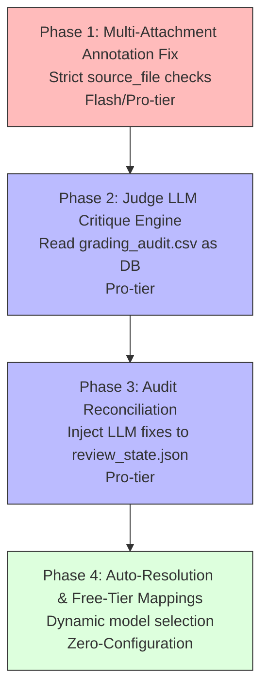

# Judge LLM Critique & Multi-Attachment Annotation Fixes

This plan establishes a reliable multi-attachment PDF annotation logic and introduces a "Judge LLM" workflow that treats `grading_audit.csv` as the source of truth for post-grading critique, ensuring perfect parity between the audit database, review server state, and Brightspace export.

---

## Phasing & Dependencies



| Phase | Focus | Tier | What it delivers |
|---|---|---|---|
| **Phase 1** | Multi-Attachment Annotation Fix | Flash | Fixes the bug where `find_anchor_in_doc` eagerly annotates the wrong PDF when multiple attachments are present. |
| **Phase 2** | Judge LLM Critique Engine | Pro | A module that ingests `grading_audit.csv` and prompts a Judge LLM to critique verdicts based on the logged `logic_analysis` and `evidence_quote`. |
| **Phase 3** | Audit Reconciliation | Pro | Inject Judge LLM fixes (verdict, reason) directly into `review_state.json` to maintain a single source of truth across the UI and Brightspace imports. |
| **Phase 4** | Auto-Resolution & Free-Tier | Flash | Zero-brain model toggling (`auto`/`free` profiles) resolved via `defaults.toml`, matching exact Google GenAI free tier rate limits. |

---

## 🤖 Phase 1: Multi-Attachment Annotation Fix

**Principle**: *If an LLM specifically cites a source file for an answer, we should not eagerly use fallback text anchors on the wrong document.*

**Recommended Agent**: Flash-tier

### Instructions

1. **Modify `annotate_submission_pdfs` in `grader/annotate.py`**:
   - Inside the loop over `rubric.questions` (around line 76), before calling `resolve_model_location`, enforce a strict `source_file` check if there are multiple PDFs.
   - Specifically, if `not single_pdf` and `q_result.source_file` is present:
     - Compare the basename case-insensitively using `Path(q_result.source_file).name.lower() != pdf_path.name.lower()`.
     - If they do not match, `continue` to the next question.
   - This prevents `find_anchor_in_doc` from incorrectly finding a fallback anchor (like "1)") on the wrong PDF. Unmatched questions will naturally fall into the `add_fallback_summary` logic at the end.

---

## 🤖 Phase 2: Judge LLM Critique Engine

**Principle**: *The `grading_audit.csv` contains the complete rationale for every grade. It acts as our database for a Judge LLM to review and identify grading mistakes.*

**Recommended Agent**: Pro-tier

### Instructions

1. **CLI Command & Module in `grader/workflow_cli.py` and `grader/judge.py`**:
   - Create `grader/judge.py`.
   - Instead of a standalone command parser, register `judge` as a subcommand under the profile-aware CLI in `grader/workflow_cli.py` (via argparse subparser).
   - Usage: `./gradeline judge --profile <profile_name>`.
   - The command should automatically load `profile.grade.output_dir / "grading_audit.csv"` (or look at the `"auto"` key in `review_state.json` if it already exists) and read the `rubric_yaml`.
   - Group the rows by `student_name`.
   - For each student, construct a prompt for the Judge LLM containing the Rubric for the question and the extracted row from `grading_audit.csv` (which includes `verdict`, `logic_analysis`, `evidence_quote`, and `detail_reason`).

2. **Define the Judge Output Schema via Pydantic**:
   - The Google GenAI SDK requires a top-level Pydantic class for `response_schema`. Define `JudgeQuestionCritique` and a container wrapper class `JudgeCritiqueResponse`:
     ```python
     from pydantic import BaseModel
     from typing import Literal

     class JudgeQuestionCritique(BaseModel):
         question_id: str
         critique: str
         proposed_verdict: Literal["correct", "partial", "rounding_error", "incorrect", "needs_review"]
         proposed_reason: str
         needs_fix: bool

     class JudgeCritiqueResponse(BaseModel):
         critiques: list[JudgeQuestionCritique]
     ```

---

## 🤖 Phase 3: Audit Reconciliation

**Principle**: *Critiques must be actionable and universally reflected. Injecting fixes into `review_state.json` guarantees that the Review UI, the audit DB, and the Brightspace import all share the same truth.*

**Recommended Agent**: Pro-tier

### Instructions

1. **Patching `review_state.json`**:
   - In `grader/judge.py`, after generating critiques, open the `review_state.json` file for the grading run.
   - For every question, inject a `"judge_critique"` block under `questions[question_id]` in the JSON state file:
     ```json
     "judge_critique": {
       "critique": "...",
       "proposed_verdict": "correct",
       "proposed_reason": "...",
       "needs_fix": true
     }
     ```
   - Always persist the review state using `write_state_atomic()` (defined in `grader/review/state.py`) to prevent data corruption.

2. **Zero-Trust Grade & Feedback Integrity (Guardrails)**:
   - > [!IMPORTANT]
   - > **Never promote `REVIEW_REQUIRED` (or any `needs_review` value) to a passing grade automatically.** All critiques must remain as pending suggestions under the `"judge_critique"` key; the CLI run must *never* overwrite `"final"` directly.
   - > **Never annotate a point deduction on a student PDF without a `short_reason`.** If the Judge proposed verdict is a deduction (`incorrect` or `partial`), ensure `proposed_reason` is non-empty. If the Judge fails to provide a reason, fall back to the rubric's `short_note_fail`.

3. **Enhance Review UI (Badge + Accept Button)**:
   - Update `grader/review/api.py` and `app.js` to load the new `"judge_critique"` block.
   - Highlight questions with a pending critique using a prominent badge.
   - Add an **"Accept Judge Fix"** button in `index.html` and `app.js` next to the badge. Clicking it should copy the `proposed_verdict` and `proposed_reason` to the editable fields (`verdictSelect` and `reasonInput`) and save the change.

---

## 🤖 Phase 4: Zero-Brain Auto-Resolution & Free-Tier Mappings

**Principle**: *The system must work out of the box. Setting model configurations to `"auto"` (standard tier) or `"free"` (free tier) resolves optimal models dynamically for each role without hardcoding model names in python logic.*

**Recommended Agent**: Flash-tier

### Instructions

1. **Configure Mappings in `configs/defaults.toml`**:
   - Define default profiles in the config:
     ```toml
     [models.auto]
     grading = "gemini-2.5-flash"
     extraction = "gemini-2.5-flash"
     locator = ""
     rubric = "gemini-2.5-pro"
     judge = "gemini-2.5-pro"

     [models.free]
     grading = "gemini-2.5-flash-lite"
     extraction = "gemini-2.5-flash-lite"
     locator = ""
     rubric = "gemini-2.5-flash"
     judge = "gemini-2.5-flash"
     ```

2. **Implement Resolution Logic in `grader/defaults.py`**:
   - Add a resolver helper `resolve_model(role: str, setting: str) -> str`.
   - It reads the corresponding `[models.auto]` or `[models.free]` table when `setting` matches `"auto"` or `"free"`. If `setting` is a concrete model name (e.g., `"gemini-1.5-pro"`), return it directly.
   - Default the default model definitions (`DEFAULT_MODEL`, etc.) to `"auto"`.

3. **Align `FREE_TIER_LIMITS` in `grader/rate_limit.py`**:
   - > [!WARNING]
   - > **Order matters!** Since `RateLimiterRegistry` uses substring matching (`if pattern in normalized`), place more specific model names *before* less specific ones to avoid incorrect matches (e.g., `"gemini-2.5-flash-lite"` must come *before* `"gemini-2.5-flash"`).
   - Adjust `FREE_TIER_LIMITS` to:
     ```python
     FREE_TIER_LIMITS: dict[str, dict[str, int]] = {
         "gemini-2.5-flash-lite": {"rpm": 10, "rpd": 1500},
         "gemini-2.5-flash":      {"rpm": 15, "rpd": 1500},
         "gemini-3-flash":         {"rpm": 15, "rpd": 1500},
         # ... keep other existing keys in correct specificity order
     }
     ```

