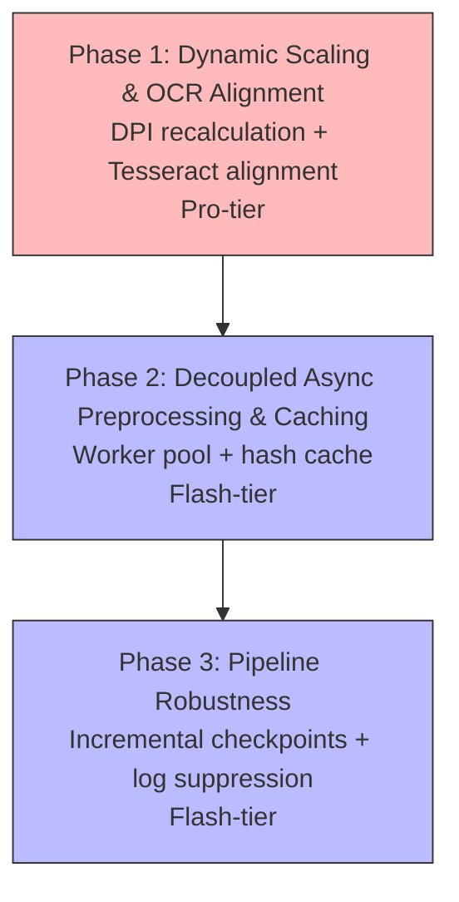

# Preprocessing & Pipeline Optimization — Agent Delegation Prompts

These prompts establish a robust, high-performance preprocessing pipeline that solves slow rendering on high-resolution scanned PDFs, resolves local OCR alignment discrepancies, decouples extraction from grading, and improves pipeline robustness with incremental progress checkpointing.

---

## Phasing & Dependencies



| Phase | Focus | Tier | What it delivers |
|---|---|---|---|
| **Phase 1** | Dynamic Scaling & OCR Alignment | Pro | Dynamically scale down large PDF pages to a max bounding box; align pdftoppm and Tesseract resolutions. |
| **Phase 2** | Decoupled Async Preprocessing & Caching | Flash | Decouple extraction into a concurrent worker pool that pre-extracts and caches results before grading. |
| **Phase 3** | Pipeline Robustness | Flash | Intercept and suppress third-party CLI warnings; write checkpoints incrementally after each graded submission. |

---

## 🤖 Phase 1: Dynamic Image Scaling & OCR Resolution Alignment

**Principle**: *Large scanned pages should be processed efficiently. A grading pipeline must never stall on CPU-heavy image conversion, nor fail OCR due to mismatched resolution parameters.*

**Recommended Agent**: Pro-tier

```markdown
You are a coding agent optimizing PDF image rendering and OCR accuracy in the extraction phase.

### Context
In `grader/extract.py`, PDF pages are rendered using `pdftoppm`. 
- In `_run_gemini_fallback()`, it uses a fixed DPI (`216.0`).
- In `run_ocr_all_pages()`, it calls `pdftoppm` with default resolution (which defaults to `150` DPI) but invokes `tesseract` with `--dpi 300` (from the default argument). This DPI mismatch causes Tesseract to process pages with incorrect scaling assumptions, degrading OCR accuracy.
- Scanned PDF submissions with huge pages (e.g. 2160 x 3840 points) take a massive amount of CPU time and memory to render at high DPIs, stalling parallel workers.

### Instructions

**1. Implement dynamic DPI calculation**
- Open `grader/extract.py`. Create a helper function `compute_optimal_dpi(pdf_path: Path, target_max_dim: float = 2048.0, default_dpi: float = 150.0) -> float`:
  - It runs `pdfinfo` to inspect the page dimensions (width and height in points).
  - Since $1\text{ point} = 1/72\text{ inch}$, the pixel size at a given DPI is $\text{pixels} = (\text{points} / 72) \times \text{DPI}$.
  - If the page width or height in points is large, calculate the DPI that would result in the longest side being exactly `target_max_dim` pixels.
  - Return the calculated DPI, clamped to a maximum of `default_dpi` (e.g., 150 or 200 DPI) to prevent unnecessary upscaling of small documents.
- **CRITICAL**: If the DPI is scaled down, Tesseract will return bounding boxes in the scaled coordinate space. You MUST scale these coordinates back to the original 72 DPI PDF point space before returning the `ExtractedPdf` object, or the visual audit annotations will be misaligned.

**2. Update `_run_gemini_fallback` to use dynamic DPI**
- In `_run_gemini_fallback`, instead of hardcoding `dpi = 216.0`, call `compute_optimal_dpi(pdf_path, target_max_dim=2048.0, default_dpi=150.0)`.
- Pass this calculated dynamic DPI to `pdftoppm` using the `-r` option.

**3. Align resolutions in `run_ocr_all_pages`**
- In `run_ocr_all_pages()`, fix the resolution mismatch:
  - Call `compute_optimal_dpi` or use a matching DPI (e.g. 150 or 300).
  - Ensure the `-r` option is passed to `pdftoppm` using the exact same DPI value that is subsequently passed to `tesseract` via `--dpi`. For example:
    ```python
    # Ensure pdftoppm uses the correct resolution
    subprocess.run([
        "pdftoppm",
        "-f", str(page_num),
        "-l", str(page_num),
        "-singlefile",
        "-r", str(int(dpi)),
        "-png",
        ...
    ])
    ```

**4. Add tests**
- In `tests/test_extract.py`, mock `pdfinfo` output for:
  - A standard letter-size PDF ($612 \times 792\text{ points}$). Assert it returns the default DPI.
  - A large scanned PDF ($2160 \times 3840\text{ points}$). Assert it computes a lower DPI to keep pixels bounded to ~2048px.
- Verify that both `_run_gemini_fallback` and `run_ocr_all_pages` execute correctly with the new dynamic scaling.

**5. Verify**
```bash
PYTHONPATH=. .venv/bin/pytest tests/ -x -q
```
```

---

## 🤖 Phase 2: Decoupled Async Preprocessing & Caching

**Principle**: *The grading engine should not mix resource-heavy document extraction with LLM API orchestration. Separating these stages allows each to run with optimal concurrency.*

**Recommended Agent**: Flash-tier

```markdown
You are a coding agent refactoring the grader to extract and cache submission content before invoking the grading pipeline.

### Context
Extraction (`extract_content` in `grader/extract.py`) runs synchronously as part of the grading loop. If a student has a slow PDF conversion or OCR phase, it holds up the grading worker pool.
We want to extract content in a separate step and cache the results.

### Instructions

**1. Create an async producer-consumer pipeline**
- We must avoid bottlenecking "time-to-first-result" by waiting for *all* PDFs to extract before grading.
- Modify `grader/orchestrator.py` to use a producer-consumer model (e.g., `asyncio.Queue` or a threading queue).
- Extraction workers (Producers) should run in parallel, extracting text/images and pushing `ExtractedPdf` objects to the queue.
- Grading workers (Consumers) should pull from this queue, allowing grading to start the moment the first PDF is extracted.
- For each submission, compute a SHA-256 hash of its PDF files to check the cache before extracting.

**2. Cache preprocessed results with versioning**
- Store preprocessed outputs (`ExtractedPdf` objects, including extracted text and spatial coordinates) in the `.grader_cache/` directory or a cache DB.
- **CRITICAL**: The cache key MUST be a composite hash: `hash(pdf_content) + EXTRACTION_VERSION` (where `EXTRACTION_VERSION` is a hardcoded constant in the code). This ensures the cache is properly invalidated if the OCR logic or Tesseract version changes.
- If a composite hash matches an existing cache entry, skip the extraction phase entirely for that file and yield it directly to the grading queue.

**3. Update grading pipeline to read from queue**
- The main grading execution should pull `ExtractedPdf` objects from the queue and run at maximum speed without invoking subprocesses like `pdftoppm` or `tesseract` directly.

**4. Add tests**
- In `tests/test_orchestrator.py`, mock a slow extraction process. Verify that calling the preprocessor runs it in parallel and saves cache entries.
- Verify that subsequent grading runs read from the cache and do not trigger re-extraction.

**5. Verify**
```bash
PYTHONPATH=. .venv/bin/pytest tests/ -x -q
```
```

---

## 🤖 Phase 3: Pipeline Robustness — Incremental Checkpoints & CLI Log Suppressing

**Principle**: *A CLI grading tool must handle system interrupts gracefully, preserve partial work dynamically, and present a premium, clean output console free of third-party library warnings.*

**Recommended Agent**: Flash-tier

```markdown
You are a coding agent implementing incremental progress checkpointing and cleaning up noisy CLI stderr output.

### Context
- Currently, the progress checkpoint `.gradeline_checkpoint.json` is saved only upon rate-limit exhaust, user interrupt, or successful completion. If the grading run is killed or crashes, all partial progress is lost.
- Third-party CLI tools (like `MuPDF` or `pdftoppm`) write warnings (such as `MuPDF error: format error: No common ancestor in structure tree`) directly to stderr, polluting the CLI progress view.

### Instructions

**1. Implement incremental checkpointing & Zero-Trust error handling**
- Open `grader/orchestrator.py`. Find the main loop where submissions are graded.
- **CRITICAL**: To satisfy the Zero-Trust State Management guardrail, wrap the grading execution of *each* submission in a broad `try...except Exception` block.
- If an unhandled exception occurs (e.g., corrupted PDF, failed OCR), catch it, flag the submission as `REVIEW_REQUIRED` with a score of `0`, and gracefully proceed.
- Whether successful or failed, call `save_checkpoint()` with the current state of completed results.
- Ensure checkpoint writing is fast and does not block the grading pipeline.

**2. Suppress noisy third-party stderr**
- In `grader/extract.py`, find the `subprocess.run` calls for `pdftoppm`, `pdftotext`, `pdfinfo`, and other tools.
- Intercept and suppress/redirect their stderr output to prevent terminal pollution.
- **CRITICAL**: Use `capture_output=True` in `subprocess.run` (which manages memory buffers safely) or redirect `stderr` directly to a file handle (e.g., `stderr=open('.grader_tmp/diagnostics.log', 'a')`). Do NOT just use `stderr=subprocess.PIPE` without reading it, as this can deadlock the subprocess if the OS pipe buffer fills up with warnings.
  - If a command succeeds, discard its stderr output.
  - If a command fails (raises `CalledProcessError`), append the stderr output to the raised exception or log it to a diagnostics file (`.grader_tmp/diagnostics.log`) so the user can debug if necessary, but keep it out of the main console stdout/stderr.

**3. Add tests**
- In `tests/test_orchestrator.py` or `tests/test_checkpoint.py`, mock a crash midway through grading. Verify that the checkpoint file was written incrementally and contains all submissions completed up to the crash.
- Verify that stderr warning pollution is successfully captured and suppressed during normal execution.

**4. Verify**
```bash
PYTHONPATH=. .venv/bin/pytest tests/ -x -q
```
```
