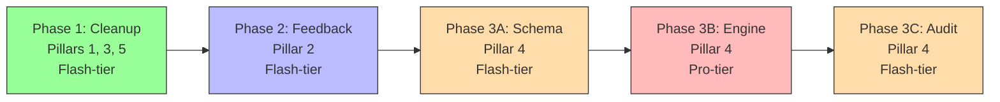

# Coding Agent Delegation Prompts — Gradeline Core Principles

These prompts are designed to be executed by coding agents across multiple sessions as the codebase evolves. Each prompt is **self-contained**: it describes the principle being enforced, the code patterns to look for, and how to verify success. Agents should grep for the named functions/classes rather than relying on line numbers.

> [!NOTE]
> **For agents reading this file**: Check `context.md` at the repo root for the current completion status of each phase before starting work. Phases marked `[x]` are done — skip them.

---

## Phasing & Dependencies



| Phase | Pillar | Tier | Key Principle |
|---|---|---|---|
| **Phase 1** | 1, 3, 5 | Flash | Never award unearned points; no hidden overrides; codify rules |
| **Phase 2** | 2 | Flash | No silent deductions — every `x` mark needs an explanation |
| **Phase 3A** | 4 | Flash | Add `expected_answers` schema to rubric + `grading_source` to results |
| **Phase 3B** | 4 | Pro | Build the regex pre-check engine inside the grading loop |
| **Phase 3C** | 4 | Flash | Wire `grading_source` into audit CSV output |

---

## 🤖 Phase 1: Cleanup — Pillars 1, 3 & 5

**Principle**: *Never award unearned points. No hidden config overrides. Codify rules for humans and AI.*

**Recommended Agent**: Flash-tier

````markdown
You are a coding agent enforcing three core principles in the Gradeline codebase.

### Context

Gradeline is a PDF grading engine. The core CLI (`grader/cli.py`) grades student 
submissions and produces `brightspace_grades_import.csv` and `grading_audit.csv`. 
There is also an ad-hoc script `finalize_grades.py` at the repo root that 
duplicates this functionality but silently assigns 10/10 to non-submissions 
and destroys the audit trail. The rate limiter in `grader/rate_limit.py` 
throttles unlisted models to 5 RPM via `DEFAULT_LIMITS`, which is too 
restrictive for paid API keys.

### Instructions

**1. Delete the redundant script**
- Delete `finalize_grades.py` from the repository root.
- It is safe to delete — the core CLI already handles Brightspace CSV mapping 
  via `write_brightspace_import_csv()` in `grader/report.py`.

**2. Add grade integrity safety tests**
- Open `tests/test_score.py`. Find the existing `ScoreTests` class and the 
  helper `make_rubric()`.
- Add a test: pass an **empty** `question_results` list to `score_submission()`. 
  Assert the result has `band == "REVIEW_REQUIRED"` and does not crash.
- Add a test: pass **all incorrect** verdicts (every question `verdict="incorrect"`). 
  Assert the result has `band == "Check Minus"` (the lowest legacy band), 
  never an empty string.

**3. Bump rate limiter defaults**
- Open `grader/rate_limit.py`. Find `DEFAULT_LIMITS`.
- Change it from `{"rpm": 5, "rpd": 500}` to `{"rpm": 60, "rpd": 14400}`.
- The `--no-rate-limit` CLI flag and `DEFAULT_RATE_LIMIT_ENABLED` already exist 
  for fully disabling rate limiting — no other changes needed.

**4. Create architectural guardrails file**
- Create `.agents/AGENTS.md` at the repo root with these rules:

```
# Gradeline Architectural Guardrails

## Grade Integrity (MUST)
- Never assign a non-zero grade to a student with no submission match.
- Never promote REVIEW_REQUIRED to a passing grade automatically.
- All grades in brightspace_grades_import.csv must trace back to an LLM 
  verdict or regex pre-check recorded in grading_audit.csv.

## Feedback Integrity (MUST)
- Never annotate a point deduction on a student PDF without a short_reason.
- If the LLM feedback is dropped (e.g. third-person), fall back to the 
  rubric's short_note_fail — never leave it blank.
- Rubric YAML must have a non-empty short_note_fail for every question.

## Config Hierarchy (MUST)
- Resolution order: configs/defaults.toml → profile TOML → CLI flags.
- Never hardcode model names outside of configs/ or FREE_TIER_LIMITS.
- Profile TOMLs that omit `model` automatically inherit DEFAULT_MODEL.
```

- Append a brief "Architectural Guardrails" section to the existing `CLAUDE.md` 
  that references `.agents/AGENTS.md` and summarizes the three invariants 
  (grade integrity, feedback integrity, config hierarchy).
- Update `README.md`'s "AI Coding Sessions & Agent Guidance" section to reference `.agents/AGENTS.md`.

**5. Verify**
```bash
source .venv/bin/activate && python3 -m pytest tests/ -x -q
```

**6. Update status**
- Mark Phase 1 as `[x]` in `context.md`.
````

---

## 🤖 Phase 2: Feedback Integrity — Pillar 2

**Principle**: *A student must never receive a point deduction without a clear explanation.*

**Recommended Agent**: Flash-tier

````markdown
You are a coding agent fixing a bug where point deductions appear on student 
PDFs without any explanation.

### Context

When the LLM returns third-person feedback (e.g. "The student forgot the 
empirical rule"), the function `derive_short_reason()` in `grader/gemini_client.py` 
detects it via `is_third_person_feedback()` and drops it — returning an empty 
string. The rubric's `short_note_fail` is passed in as a parameter called 
`fallback_fail_note` but is **never used** in the return path.

This means the annotation function `mark_text_for_result()` in `grader/annotate.py` 
renders just `x Q6` with no explanation, because `result.short_reason` is empty.

### Instructions

**1. Wire the rubric fallback**
- Open `grader/gemini_client.py`. Find `derive_short_reason()`.
- It currently ends with `return ""` when the candidate is None or third-person.
- Change this to `return fallback_fail_note or ""`.
- This ensures that when LLM feedback is dropped, the rubric-configured 
  `short_note_fail` (e.g. "Empirical Rule", "Complement Rules") is used instead.

**2. Validate rubric schema at load time**
- Open `grader/config.py`. Find where `QuestionRubric` objects are constructed 
  (look for the function that parses rubric YAML and creates `QuestionRubric` 
  instances).
- After construction, check if `short_note_fail` is empty, whitespace-only, or 
  equals the generic default `"Check"`.
- If so, emit a **warning** (not an error — we don't want to break existing 
  rubrics) suggesting the instructor provide a descriptive failure note for 
  that question ID. Use `print()` or `warnings.warn()`.

**3. Add tests**
- Open `tests/test_gemini_contract.py`. Find existing tests for 
  `derive_short_reason` or `normalize_feedback`.
- Add a test: when `raw_short_reason` is `"The student forgot the empirical rule"` 
  and `fallback_fail_note` is `"Empirical Rule"`, assert the returned 
  `short_reason` equals `"Empirical Rule"` (not empty string).
- Add a test: when `raw_short_reason` is a clean, direct phrase like 
  `"Missing calculation"`, assert it is returned as-is (not replaced by fallback).

**4. Update documentation**
- Update `README.md`'s **Notes** section: replace the "No-Fallback Policy" description with the new fallback logic (dropped LLM feedback falls back to the rubric's `short_note_fail` rather than dropping the note entirely).

**5. Verify**
```bash
source .venv/bin/activate && python3 -m pytest tests/ -x -q
```

**6. Update status**
- Mark Phase 2 as `[x]` in `context.md`.
````

---

## 🤖 Phase 3A: Hybrid Pipeline — Schema Changes (Pillar 4)

**Principle**: *Don't use expensive LLM calls to grade what regex can verify.*

**Recommended Agent**: Flash-tier

````markdown
You are a coding agent adding schema support for deterministic regex grading 
to the Gradeline rubric system. This phase is schema-only — no engine logic yet.

### Context

Currently, every question is graded by the LLM regardless of complexity. 
We want to allow rubric authors to specify `expected_answers` patterns so 
that exact numeric answers can be verified by regex, bypassing the LLM.

### Instructions

**1. Add `expected_answers` to `QuestionRubric`**
- Open `grader/types.py`. Find the `QuestionRubric` frozen dataclass.
- Add a new optional field: `expected_answers: list[str] = field(default_factory=list)`
- This will hold regex patterns (e.g. `["493.*557", "461.*589"]`).

**2. Add `grading_source` to `QuestionResult`**
- In the same file, find the `QuestionResult` frozen dataclass.
- Add a new optional field: `grading_source: str = "llm"`
- Valid values will be `"llm"` (default), `"regex"`, or `"dry_run"`.

**3. Update the rubric parser**
- Open `grader/config.py`. Find where YAML is parsed into `QuestionRubric` 
  instances.
- Parse the optional `expected_answers` key as a list of strings. If absent, 
  default to an empty list.
- Also update `grader/gemini_client.py` — search for where `QuestionRubric`-like 
  dicts are constructed from LLM rubric normalization responses. Ensure the 
  `expected_answers` key is handled (defaulting to `[]`).

**4. Update the workflow profile schema**
- Open `grader/workflow_profile.py`. Check `ALLOWED_GRADE_KEYS` — no changes 
  needed here since `expected_answers` lives in the rubric YAML, not the 
  profile TOML.

**5. Fix cascading test breakage**
- The `QuestionResult` dataclass is used extensively in tests. Run the full 
  test suite and fix any tests that break due to the new `grading_source` field.
- Most tests construct `QuestionResult` with positional or keyword args — the 
  new field has a default value so they should mostly work. Fix any that don't.

**6. Verify**
```bash
source .venv/bin/activate && python3 -m pytest tests/ -x -q
```

**7. Update status**
- Mark Phase 3A as `[x]` in `context.md`.
````

---

## 🤖 Phase 3B: Hybrid Pipeline — Regex Engine (Pillar 4)

**Principle**: *If a rubric question has `expected_answers` patterns and the student's extracted text matches, skip the LLM entirely.*

**Recommended Agent**: Pro-tier (this is the most complex phase)

````markdown
You are a coding agent building a regex pre-check engine that bypasses expensive 
LLM calls when simple pattern matching can verify a correct answer.

### Context

After Phase 3A, `QuestionRubric` has an `expected_answers: list[str]` field 
and `QuestionResult` has a `grading_source: str` field. Now we need to wire 
them together inside the grading pipeline.

### Architecture Decision

The grading function `grade_one_submission()` in `grader/cli.py` supports 
3 modes: `legacy`, `unified`, and `agent`. In legacy mode, text is extracted 
before grading. In unified/agent mode, PDFs go directly to the model — but 
there is an **optional** `extract_blocks` pass that runs OCR anyway (used for 
annotation placement). 

The regex pre-check should:
1. Run **after** text extraction (in legacy mode) or after the optional 
   `extract_blocks` pass (in unified/agent mode).
2. Check each question's `expected_answers` patterns against the extracted text.
3. If ALL patterns match for a question, create a `QuestionResult` with 
   `verdict="correct"`, `confidence=1.0`, `grading_source="regex"`.
4. Only send the **remaining unmatched questions** to the LLM.
5. If `extract_blocks` is disabled in unified/agent mode and a question has 
   `expected_answers`, log a warning that regex pre-check was skipped due to 
   no extracted text.

### Instructions

**1. Create the pre-check function**
- Add a new function (suggest name: `regex_precheck`) either in `grader/cli.py` 
  or a new file `grader/precheck.py`.
- Signature: takes a `RubricConfig` and the combined extracted text (or block 
  registry text), returns a `dict[str, QuestionResult]` mapping question IDs 
  to pre-checked results.
- For each question with non-empty `expected_answers`:
  - Compile each pattern with `re.IGNORECASE | re.DOTALL`.
  - Search the extracted text for each pattern.
  - If ALL patterns match, emit a `QuestionResult` with `grading_source="regex"`.
  - If any pattern fails to match, skip (let the LLM handle it).

**2. Integrate into `grade_one_submission()`**
- After text extraction (all modes) but before the LLM call, invoke the 
  pre-check function.
- Collect the pre-checked results.
- When calling the grader (legacy `grade_submission`, unified 
  `grade_submission_unified`, or agent `grade_submission_agent`), the current 
  code sends the full rubric. For now, **still send the full rubric** to the 
  LLM — but after receiving LLM results, **replace** LLM results with regex 
  results for any question that was pre-checked. This is safer than trying to 
  filter questions out of the rubric before sending.
- Merge the two result sets into the final `question_results` list.

**3. Add tests**
- Create `tests/test_precheck.py` (or add to `tests/test_score.py`).
- Test: question with `expected_answers=["493.*557"]`, text containing 
  `"The range is 493,000 to 557,000"` → `verdict="correct"`, 
  `grading_source="regex"`.
- Test: question with `expected_answers=["493.*557"]`, text containing 
  `"The range is 400,000 to 600,000"` → no result (falls through to LLM).
- Test: question with empty `expected_answers` → no result (falls through).
- Test: question with multiple patterns, only some match → no result 
  (ALL must match).

**4. Update documentation**
- Update `README.md`'s **How It Works** section to document the regex pre-check step inserted between text extraction and grading.

**5. Verify**
```bash
source .venv/bin/activate && python3 -m pytest tests/ -x -q
```

**6. Update status**
- Mark Phase 3B as `[x]` in `context.md`.
````

---

## 🤖 Phase 3C: Hybrid Pipeline — Audit Trail (Pillar 4)

**Principle**: *Instructors must be able to see which grading engine (LLM vs regex) made each call.*

**Recommended Agent**: Flash-tier

````markdown
You are a coding agent wiring the `grading_source` field into the audit CSV 
so instructors can see which engine graded each question.

### Context

After Phase 3B, `QuestionResult` objects have a `grading_source` field that 
is either `"llm"` or `"regex"`. The audit CSV is written by 
`write_grading_audit_csv()` in `grader/report.py`. It currently does not 
include `grading_source`.

### Instructions

**1. Update the audit CSV writer**
- Open `grader/report.py`. Find `write_grading_audit_csv()`.
- Add a `grading_source` column to the CSV output. For each question result 
  row, include the value of `result.grading_source`.
- Place it after the `verdict` column for logical grouping.

**2. Update any audit CSV readers**
- Search the codebase (grep for `grading_audit`) to find any code that reads 
  the audit CSV. Update those readers to handle the new column gracefully 
  (it may not exist in older audit files).

**3. Add a test**
- Find the existing test for `write_grading_audit_csv` (likely in 
  `tests/test_review_exporter.py` or similar).
- Assert that the output CSV contains the `grading_source` column and that 
  it correctly reflects the values from the input `QuestionResult` objects.

**4. Update documentation**
- Update `README.md`'s **Outputs** section to describe the new `grading_source` column in `grading_audit.csv`.

**5. Verify**
```bash
source .venv/bin/activate && python3 -m pytest tests/ -x -q
```

**6. Update status**
- Mark Phase 3C as `[x]` in `context.md`.
````

