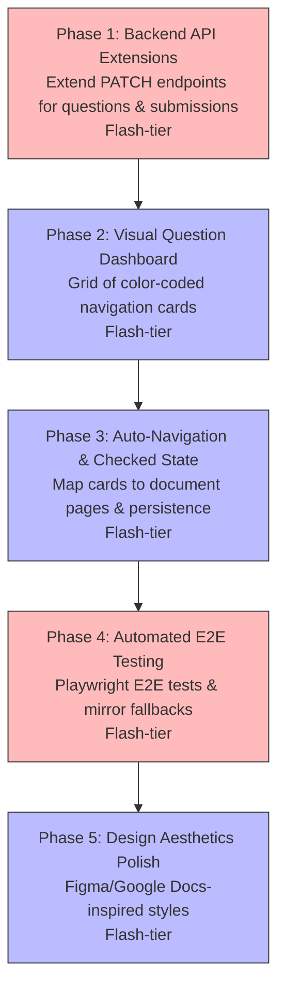

# Review Server UX Improvements Plan

This plan establishes a professional, high-performance grading review experience that transitions the review server from a bare-bones system to an intuitive, interactive dashboard. It adds a visual question checklist, auto-navigation on click, explicit submission review status overrides, and responsive card-based layout controls.

---

## Phasing & Dependencies



| Phase | Focus | Tier | What it delivers |
|---|---|---|---|
| **Phase 1** | Backend API Extensions | Flash | Support custom `reviewed` flag in question payload; support manual `review_status` overrides on submission PATCH. *(Implemented & verified)* |
| **Phase 2** | Visual Question Dashboard | Flash | Render a color-coded grid of cards next to the active student name for rapid assessment. *(Implemented & verified)* |
| **Phase 3** | Auto-Navigation & Checked State | Flash | Auto-scroll/jump the viewer to the correct PDF page/document upon card click; persist reviewed checks. *(Implemented & verified)* |
| **Phase 4** | Automated E2E Testing | Flash | Establish Playwright E2E browser tests to verify Phase 1-3 features and document fallback mirror setup for local devs/CI. *(Implemented & verified)* |
| **Phase 5** | Design Aesthetics Polish | Flash | Clean Google/Figma-style CSS layout, card borders, active shadow states, and hover animation micro-interactions. |

---

## 🤖 Phase 1: Backend API Extensions

**Principle**: *A grading review database must persist the state of human actions. Instructors need a way to mark both individual questions and whole submissions as reviewed, while decoupling user workflow state from automated grade calculations.*

**Recommended Agent**: Flash-tier

### Instructions

1. **Add `reviewed_final` property to question PATCH**:
   - In [grader/review/api.py](file:///Users/walsh.kang/Documents/GitHub/gradeline/grader/review/api.py#L279) under `patch_question(self, submission_id: str, question_id: str, payload: dict[str, Any])`:
     - Intercept `"reviewed_final"` in `payload`.
     - Save it to `final_payload["reviewed"] = bool(payload["reviewed_final"])`.
     - This ensures it will be saved automatically in the state dict and serialized to `review_state.json`.

2. **Add submission PATCH endpoint & Decoupled State**:
   - In [grader/review/api.py](file:///Users/walsh.kang/Documents/GitHub/gradeline/grader/review/api.py), create a new method `patch_submission(self, submission_id: str, payload: dict[str, Any]) -> dict[str, Any]`:
     - Access `submission = self._get_submission(submission_id)`.
     - If `"review_status"` is in `payload`, validate it is one of `{"todo", "in_progress", "done"}` and save it: `submission["review_status"] = status`.
     - Set `submission["manual_status_override"] = True` to flag this status as manually controlled.
     - Save, persist the state, append a `submission_updated` event, and return the updated submission identity and status.
   - Guard the automatic `review_status` reassignment in `_recompute_submission_summary(self, submission)`:
     - Only assign the automatic status if `not submission.get("manual_status_override")`.
   - In [grader/review/server.py](file:///Users/walsh.kang/Documents/GitHub/gradeline/grader/review/server.py#L113), under `do_PATCH(self)`:
     - Match `/api/submissions/([^/]+)` route.
     - Call `self.api.patch_submission(submission_id, body)` and return the payload.

---

## 🤖 Phase 2: Visual Question Dashboard

**Principle**: *Dropdown menus restrict context. An instructor should see the status of all questions side-by-side to understand grading progress at a single glance.*

**Recommended Agent**: Flash-tier

### Instructions

1. **Modify `index.html`**:
   - Locate the editor pane (`<aside class="editor">`) in [grader/review/static/index.html](file:///Users/walsh.kang/Documents/GitHub/gradeline/grader/review/static/index.html#L80).
   - Add a `<div class="question-grid" id="questionNavGrid"></div>` right below the student title section.
   - Add a custom checkbox wrapper below it:
     ```html
     <div class="checkbox-container-custom">
       <input type="checkbox" id="questionReviewedCheckbox" />
       <label for="questionReviewedCheckbox">Mark Question as Reviewed</label>
     </div>
     ```
   - In the student summary box, add a manual submission-level review status dropdown:
     ```html
     <div class="submission-status-control" style="margin-top: 1rem; display: flex; align-items: center; justify-content: space-between;">
       <label for="submissionStatusSelect" style="font-weight: bold; margin-bottom: 0;">Review Status:</label>
       <select id="submissionStatusSelect" style="width: auto;">
         <option value="todo">Todo</option>
         <option value="in_progress">In Progress</option>
         <option value="done">Reviewed</option>
       </select>
     </div>
     ```

2. **Render Grid Cards in `app.js`**:
   - Create `renderQuestionNavGrid()` which gets the list of questions for `state.currentSubmission`.
   - Clear the `#questionNavGrid` container and append a card for each question:
     - Apply class `.question-nav-card` and the corresponding verdict class (`.correct`, `.rounding_error`, `.partial`, `.incorrect`, `.needs_review`).
     - Display `Q{id}` and the verdict icon.
     - If the question's `reviewed` property is true, add the `.reviewed` class and append a small check-mark badge `<span class="q-check-badge">✓</span>`.
     - Add click handler calling `selectQuestion(qId)`.
   - Update `renderSubmission()` to call `renderQuestionNavGrid()`, synchronize the state of `questionReviewedCheckbox`, and synchronize `submissionStatusSelect`.

---

## 🤖 Phase 3: Auto-Navigation & Checked State

**Principle**: *Reviewing answers requires seeing them. Moving from question to question must automatically align the PDF viewer with the corresponding target coordinates.*

**Recommended Agent**: Flash-tier

### Instructions

1. **Implement `selectQuestion(questionId)` in `app.js`**:
   - When a card is clicked, set `state.currentQuestionId` and sync the hidden select `ui.questionSelect.value`.
   - Inspect the selected question's `page_number` and `source_file`.
   - If they are set and differ from the current page/document, update `state.currentPageIdx` and `state.currentDocIdx`, update the inputs, and call `await loadCurrentPage()`.
   - Execute `renderSubmission()` and `renderQuestionNavGrid()`.

2. **Wire Checkbox Listeners & Frontend Guardrails**:
   - Add change listener to `#questionReviewedCheckbox`. When toggled, call `queuePatch({ reviewed_final: checkbox.checked }, 150)` and update the visual badge on the nav grid card.
   - Add change listener to `#submissionStatusSelect`. When changed:
     - Check if the new value is `"done"` and if the student still has unresolved questions (`state.currentSubmission.needs_review_count > 0`).
     - If so, show a confirmation dialog/modal: *"This submission has unresolved questions. It will be exported to Brightspace as REVIEW_REQUIRED (no points). Are you sure you want to mark this as Done?"*
     - If the user cancels, revert the dropdown to its previous value and exit.
     - If confirmed (or if the new value is not `"done"` / has no unresolved questions), make a PATCH to `/api/submissions/{id}` to update `review_status` on the backend, and trigger `renderQueue()` to refresh the student list badge.

---

## 🤖 Phase 4: Automated E2E Testing

**Principle**: *A test-driven development workflow must cover integration layers. Manual verification of UI interactions is fragile, so E2E test scripts must automate browser testing and handle cross-platform setup errors natively.*

**Recommended Agent**: Flash-tier

### Instructions

1. **Create `requirements-dev.txt`**:
   - Add the dev/test dependencies to [requirements-dev.txt](file:///Users/walsh.kang/Documents/GitHub/gradeline/requirements-dev.txt):
     ```text
     pytest-playwright>=0.5.0
     playwright>=1.40.0
     ```

2. **Add setup automation instructions**:
   - Document or script the setup with mirror fallbacks for macOS/Linux ARM64 users experiencing CDN download issues:
     ```bash
     export PLAYWRIGHT_DOWNLOAD_HOST=https://npmmirror.com/mirrors/playwright
     playwright install chromium
     ```

3. **Implement UI integration tests in `tests/test_review_ui.py`**:
   - Create a Pytest fixture that launches the review server in a background thread or subprocess.
   - Use Playwright to:
     - Navigate to the review server index page.
     - Verify that the `#questionNavGrid` renders the expected color-coded grid of cards.
     - Simulate clicking a `.question-nav-card` to verify that active page/document indices change dynamically.
     - Verify that checking/unchecking `#questionReviewedCheckbox` triggers a PATCH request to `/api/submissions/{subId}/questions/{qId}` with `{ reviewed_final: true/false }`.
     - Verify that changing the submission status dropdown triggers a PATCH to `/api/submissions/{subId}`.
     - Test that changing the status to "done" when there are unresolved questions displays the confirmation dialog and allows canceling/confirming.

---

## 🤖 Phase 5: Design Aesthetics Polish

**Principle**: *Premium web applications feel clean and responsive. Colors must be curated, fonts balanced, and micro-animations smooth.*

**Recommended Agent**: Flash-tier

### Instructions

1. **Append custom CSS to `styles.css`**:
   - Apply clean CSS styling for `.question-grid` and `.question-nav-card` using modern flexbox/grid.
   - Color-code verdicts: Success-green (`#34a853`), Warning-orange (`#f9ab00`), Error-red (`#ea4335`), and Neutral-muted (`#80868b`).
   - Add pointer-hover interactions (`transform: translateY(-1px)`) and transition easing.
   - Style `.q-check-badge` as a small absolute-positioned green dot with white checkmark at the top-right corner of the card.
   - Style `.checkbox-container-custom` with a light dashed border and clean spacing.
