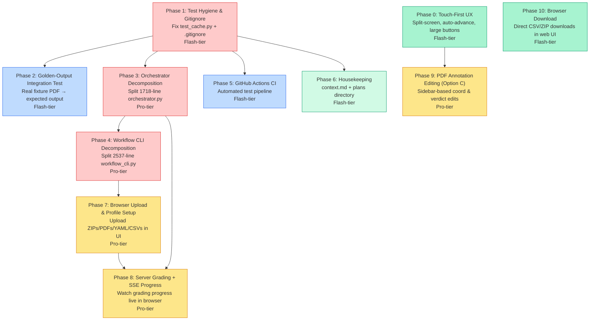

# Stability, Decomposition & Browser-First Grading Plan

This plan merges the stability/decomposition objectives with a browser-first architecture. It closes existing codebase gaps (broken test collection, large files, missing integration coverage, CI automation) and lays out the transition to running the full grading and editing lifecycle directly in the web browser.

---

## Phasing & Dependencies



| Phase | Focus | Tier | What it delivers |
|---|---|---|---|
| **Phase 1** | Test Hygiene & Gitignore | Flash | Fix `test_cache.py` collection error; add caching/bytecode patterns to `.gitignore`; relocate root-level test file. |
| **Phase 2** | Golden-Output Integration Test | Flash | Run extraction → pre-check → scoring end-to-end with local fixture PDF and assert deterministic output. |
| **Phase 3** | Orchestrator Decomposition | Pro | Split `orchestrator.py` into modular sub-packages to make grading programmatically importable. |
| **Phase 4** | Workflow CLI Decomposition | Pro | Split `workflow_cli.py` into reusable quickstart, import, and profile submodules. |
| **Phase 5** | GitHub Actions CI | Flash | Add automated CI runners for pytest and Playwright UI tests on push/PR. |
| **Phase 6** | Housekeeping | Flash | Update `context.md` and keep `docs/plans/` organized. |
| **Phase 0** | Click-Only & Touch-First UX | Flash | Split-screen mobile layout, large verdict buttons, auto-advance toggle, and coordinate-aligned auto-scrolling. |
| **Phase 7** | Browser File Upload & Profile Setup | Pro | Drag-and-drop file uploads (including ZIP extraction) and configuration panel to setup profile without terminal. |
| **Phase 8** | Server Grading + SSE Progress | Pro | Run grading engine from browser with Server-Sent Events (SSE) progress bar and logs. |
| **Phase 9** | PDF Annotation Editing (Option C) | Pro | Sidebar-based editing of verdicts/coordinates, showing real-time feedback and updating PDF rendering. |
| **Phase 10**| Browser Download | Flash | Stream reviewed PDFs ZIP and Brightspace grades CSV directly as browser downloads. |

---

## Architectural Decisions & Design Guidelines

1. **CLI as Fallback**: The CLI workflow remains fully supported and unchanged. All browser setup and grading features build on top of decomposed core modules.
2. **Decomposition First**: Orchestrator and CLI decomposition (Phases 3 & 4) MUST be completed and merged before adding any browser-side grading or setup APIs to avoid massive merge conflicts.
3. **Seamless ZIP Extraction**: The browser file upload system will support uploading standard Brightspace downloaded ZIPs directly, performing server-side extraction and structure validation automatically.
4. **Sidebar-first Annotation Editing (Option C)**:
   - Click-to-place and drag-to-reposition markers already exist in `app.js` (via `ui.imageWrap.addEventListener("click", ...)` and `ui.marker` pointer handlers). Phase 9 adds sidebar X/Y numeric inputs and a multi-marker overlay — it does NOT re-implement click/drag.
   - Coordinates use a **0–1000 scale** (not 0–1). `convertClientPointToNormalized` clamps to 1000, `renderMarker` divides by 1000. All new code must use this convention.
   - Canvas-overlay drawing remains a future enhancement.
5. **SSE for Live Progress**: Live grading feedback uses Server-Sent Events (SSE) for simple, robust one-way updates.
6. **AGENTS.md Guardrails Apply Everywhere**: All phases must respect the Grade Integrity, Feedback Integrity, Config Hierarchy, and Zero-Trust State Management guardrails defined in [.agents/AGENTS.md](file:///Users/walsh.kang/Documents/GitHub/gradeline/.agents/AGENTS.md).

---

## 🤖 Phase 0: Click-Only & Touch-First UX

**Principle**: *A grading review experience must be highly optimized for direct clicking and touch interaction, preventing endless scrolling or tedious multi-click workflows on mobile, tablet, and web.*

**Recommended Agent**: Flash-tier

### Instructions

1. **Split-Screen / Bottom-Sheet Mobile Layout**:
   - In `styles.css`, modify the responsive media query (`@media (max-width: 1180px)`) to use a split-screen or flexible sheet layout rather than stacking the panels into a single long vertical column.
   - Set the PDF viewer (`.viewer`) to have a fixed height (e.g., `55vh`) with `overflow: auto`.
   - Set the editing controls (`.editor`) to occupy the remaining height in a scrollable, touch-friendly panel (bottom-sheet) so that both the PDF and grade fields are simultaneously visible.

2. **One-Tap Verdict Buttons & Auto-Advance**:
   - In `index.html`, add a row of large, colorful, touch-friendly buttons for verdicts (`Correct`, `Rounding Error`, `Partial`, `Incorrect`, `Needs Review`) right next to or replacing the select element `#verdictSelect`.
   - Add an `Auto-Advance` toggle checkbox in the editor panel: `<input type="checkbox" id="autoAdvanceToggle" checked />`.
   - In `app.js`, when a verdict button or "Accept Judge Fix" is tapped/clicked:
     - Instantly save the verdict.
     - Automatically check/toggle `reviewed_final` to `true`.
     - If `Auto-Advance` is enabled, find the next card in the `#questionNavGrid` that is unresolved (verdict is `needs_review` or not marked reviewed) and programmatically trigger `selectQuestion(nextQId)`.

3. **Smooth Scroll to PDF Coordinates**:
   - In `app.js` (within `selectQuestion` and `renderMarker`), when a question is selected and has valid coordinates `[y, x]`:
     - Calculate pixel offsets `(px, py)` on the page image.
     - Scroll `ui.imageWrap` smoothly to center the marker:
       ```javascript
       ui.imageWrap.scrollTo({
         top: py - ui.imageWrap.clientHeight / 2,
         left: px - ui.imageWrap.clientWidth / 2,
         behavior: "smooth"
       });
       ```
     - Add a brief CSS keyframe scale/opacity pulse to `#marker` to highlight the location visually when selected.
     - Enhance touch targets for the marker dot (using `::after` padding) to allow easier finger-dragging on mobile/touch interfaces.

---

## 🤖 Phase 1: Test Hygiene & Gitignore

**Principle**: *A test suite that cannot collect is worse than no test suite — it silently hides regressions behind a collection error banner. Every test must be importable without side effects.*

**Recommended Agent**: Flash-tier

### Instructions

1. **Fix or relocate `test_cache.py`**:
   - The file [test_cache.py](file:///Users/walsh.kang/Documents/GitHub/gradeline/test_cache.py) is a scratch/debug script sitting at the **project root** (not inside `tests/`). It runs real API calls at import time (line 8: `GeminiGrader(api_key=os.environ.get("GEMINI_API_KEY", ""))`) which causes `ValueError: No API key` during `pytest` collection.
   - This is **not a proper test** — it's a one-off debug script with no assertions, no test functions, and hardcoded paths (`/Users/walsh.kang/Downloads/HW1 6-8 Solutions Summer 26.pdf`).
   - **Delete** the file and its `__pycache__/` sibling at the project root.
   - If any useful logic from this script should be preserved (context cache key computation testing), create a proper test in `tests/test_context_cache.py` that:
     - Mocks `GeminiGrader.__init__` to avoid requiring a real API key.
     - Uses a small fixture rubric (not a hardcoded path).
     - Asserts that `compute_context_cache_key` returns a stable hash given the same inputs.

2. **Update `.gitignore`**:
   - Open [.gitignore](file:///Users/walsh.kang/Documents/GitHub/gradeline/.gitignore). Append:
     ```gitignore
     __pycache__/
     *.pyc
     *.pyo
     .pytest_cache/
     ```
   - Run `git rm -r --cached '*/__pycache__' '*.pyc' 2>/dev/null` to remove any already-tracked bytecode files from the index.

3. **Verify**:
   ```bash
   PYTHONPATH=. .venv/bin/pytest tests/ --co -q  # should show 0 errors during collection
   PYTHONPATH=. .venv/bin/pytest tests/ -x -q      # all tests pass
   ```

---

## 🤖 Phase 2: Golden-Output Integration Test

**Principle**: *Mock-only test suites prove the code does what you told it to do. A golden-output test with a real PDF proves the pipeline actually works end-to-end, catching regressions that no mock can detect.*

**Recommended Agent**: Flash-tier

### Instructions

1. **Create a minimal fixture PDF**:
   - Create `tests/fixtures/` directory.
   - Generate a small 1-page PDF programmatically using `reportlab` or `fpdf2` containing 3 clearly answerable questions with typed numeric answers:
     ```
     Q1) What is 2 + 2?  Answer: 4
     Q2) What is 10 * 5? Answer: 50
     Q3) What is 100 / 4? Answer: 25
     ```
   - Save as `tests/fixtures/sample_submission.pdf`.
   - Create a matching rubric `tests/fixtures/sample_rubric.yaml` with `expected_answers` patterns for all three questions.
   - Create a matching solutions PDF `tests/fixtures/sample_solutions.pdf`.

2. **Create `tests/test_integration_golden.py`**:
   - Import `extract_pdf_text` from `grader.extract`, `regex_precheck` from `grader.precheck`, `score_submission` from `grader.score`, and `load_rubric` from `grader.config`.
   - Write a test `test_regex_precheck_golden_output`:
     - Load the fixture rubric.
     - Run `extract_pdf_text` on the fixture PDF.
     - Run `regex_precheck` over the extracted text against the rubric.
     - Assert all 3 questions return `grading_source="regex"` and `verdict="correct"`.
   - Write a test `test_scoring_golden_output`:
     - Build a `SubmissionResult` from the pre-check results.
     - Run `score_submission` and assert the final band is `CHECK_PLUS`.
   - Write a test `test_annotation_golden_output`:
     - Run `annotate_submission_pdfs` on the fixture PDF with the pre-check results.
     - Assert the annotated PDF exists and is a valid PDF.

3. **Skip condition for missing binaries**:
   - Guard tests that depend on `pdftoppm` or `tesseract` with `pytest.importorskip` or `shutil.which` checks so they skip gracefully in environments without system OCR tools.

4. **Verify**:
   ```bash
   PYTHONPATH=. .venv/bin/pytest tests/test_integration_golden.py -x -v
   ```

---

## 🤖 Phase 3: Orchestrator Decomposition

**Principle**: *A 1718-line file with 35 functions and 3 classes is a merge conflict factory. Each concern — grading logic, preprocessing/caching, and batch orchestration — should live in its own module with a clear API boundary.*

**Recommended Agent**: Pro-tier

> [!NOTE]
> **Lineage**: `orchestrator.py` already went through a full refactor in the End-State Architecture plan (Slices 1–3, marked complete in `context.md`). This is a second-pass decomposition into separate files, not a first pass.

> [!IMPORTANT]
> This is a **pure refactor** — no behavioral changes. Every existing test must continue to pass without modification. All imports from `grader.orchestrator` must remain valid (re-export from `__init__` or the orchestrator module itself).

### Guardrails

- **Config Hierarchy**: The config resolution order (`defaults.toml → profile TOML → CLI flags`) is exactly the kind of thing that quietly breaks during a large file split. After extraction, explicitly diff that `GradingConfig` construction and all `resolve_*` calls produce identical behavior.
- **Mock-target preservation**: Multiple test files use `@patch("grader.orchestrator.grade_one_submission")`. The re-export approach only keeps these patches working if `Orchestrator`'s internal call sites keep calling the **bare name** `grade_one_submission(...)` rather than a qualified `grading.grade_one_submission(...)`. Qualifying the call "for clarity" silently breaks at least three test files' mocking (`test_orchestrator_errors.py`, `test_orchestrator_cache.py`, `test_orchestrator_zero_trust.py`). This must be an explicit, named constraint.

### Definition of Done

- `orchestrator.py` shrinks to a **≤900-line coordinator** (from ~1718).
- `grading.py` contains ~350 lines of stateless per-submission grading logic.
- `preprocessing.py` contains ~200 lines of caching/hashing logic.

### Instructions

1. **Extract `grader/grading.py`** (~350 lines):
   - Move from [orchestrator.py](file:///Users/walsh.kang/Documents/GitHub/gradeline/grader/orchestrator.py):
     - `grade_one_submission()` (line 321–633) — the core single-submission grading function
     - `collect_locator_candidates()` (line 663–699)
     - `apply_locator_candidates()` (line 700–737)
     - `build_annotation_progress_callback()` (line 634–645)
     - `build_grading_progress_callback()` (line 646–662)
   - These functions are stateless. Update imports in `orchestrator.py` to use `from .grading import grade_one_submission, ...`.
   - **Critical**: `orchestrator.py` must call `grade_one_submission(...)` by bare name (not `grading.grade_one_submission(...)`) so that `@patch("grader.orchestrator.grade_one_submission")` in tests continues to intercept it.

2. **Extract `grader/preprocessing.py`** (~200 lines):
   - Move from `Orchestrator` class methods:
     - `compute_submission_pdf_hash()` (line 1340) → make it a standalone function
     - `get_or_compute_preprocessing()` (line 1355) → standalone function
     - `compute_cache_key_for_submission()` (line 1421) → standalone function
   - Move related helpers:
     - `StageTiming` dataclass
     - `SubmissionTelemetry` dataclass

3. **Keep `orchestrator.py` as the coordinator** (target: ≤900 lines):
   - Retains: `GradingConfig`, `Orchestrator` class (with `.run()`, `.process_student()`, `.annotate_and_finish()`, `._conclude()`, `._shutdown_executors()`), `RollingSnapshot`, rolling snapshot helpers, `summarize_results()`.
   - Re-export moved symbols for backward compatibility:
     ```python
     from .grading import grade_one_submission, collect_locator_candidates, apply_locator_candidates
     from .preprocessing import compute_submission_pdf_hash, get_or_compute_preprocessing
     ```

4. **Verify** (beyond just pytest):
   ```bash
   PYTHONPATH=. .venv/bin/pytest tests/ -x -q
   # Verify config resolution is identical:
   python3 -c "from grader.orchestrator import GradingConfig; print('GradingConfig importable')"
   # Verify mock targets still work:
   PYTHONPATH=. .venv/bin/pytest tests/test_orchestrator_errors.py tests/test_orchestrator_cache.py tests/test_orchestrator_zero_trust.py -v
   ```

---

## 🤖 Phase 4: Workflow CLI Decomposition

**Principle**: *A 2537-line CLI module with 58 functions is unmaintainable. Quickstart logic, import logic, and profile management are independent domains that should be separately testable.*

**Recommended Agent**: Pro-tier

> [!IMPORTANT]
> Same rule as Phase 3: **pure refactor, no behavioral changes**. The `main()` entry point and all argparse subcommands must work identically. Re-export moved symbols from `workflow_cli.py` for backward compatibility.

### Guardrails

- **Config Hierarchy**: `workflow_cli.py` implements the `defaults.toml → profile TOML → CLI flags` resolution chain. After extraction, verify that `build_grading_argv()` and `run_from_profile()` still produce identical argv lists and that no model names are hardcoded outside `configs/`.

### Definition of Done

- `workflow_cli.py` shrinks to a **≤1200-line CLI entry point** (from ~2537).
- `quickstart.py` (~500 lines), `import_cmd.py` (~200 lines), and `profile_utils.py` (~200 lines) are independently importable without triggering Rich console output or stdin prompts at import time.

### Instructions

1. **Create `grader/workflow/` package**:
   - Create `grader/workflow/__init__.py` that re-exports `main` and `build_parser` for backward compatibility.

2. **Extract `grader/workflow/quickstart.py`** (~500 lines):
   - Move from [workflow_cli.py](file:///Users/walsh.kang/Documents/GitHub/gradeline/grader/workflow_cli.py):
     - `quickstart_profile_interactive()`
     - `initialize_quickstart_state()`
     - `render_quickstart_summary()`
     - `format_quickstart_value()`
     - `edit_quickstart_field()`
     - `_do_edit_quickstart_field()`
     - `prompt_path_candidate()`
     - `prompt_text_candidate()`
     - `validate_quickstart_values()`
     - `must_path()`, `must_text()`, `must_port()` helpers
     - `maybe_generate_rubric_with_ai()`

3. **Extract `grader/workflow/import_cmd.py`** (~200 lines):
   - Move `import_assignment_assets()`, `_find_brightspace_zip()`, and `_extract_brightspace_zip()`.

4. **Extract `grader/workflow/profile_utils.py`** (~200 lines):
   - Move all profile, string manipulation, and helper utilities.

5. **Keep `workflow_cli.py` as CLI entry point** (target: ≤1200 lines):
   - Retain argparse definitions, `main()`, interactive menu and setup runners. Re-export all necessary functions.

6. **Verify**:
   ```bash
   PYTHONPATH=. .venv/bin/pytest tests/ -x -q
   ./gradeline --help
   ```

---

## 🤖 Phase 5: GitHub Actions CI

**Principle**: *Tests that only run on a developer's laptop are documentation, not enforcement. A CI pipeline on every push turns the test suite into a gate.*

**Recommended Agent**: Flash-tier

### Instructions

1. **Create `.github/workflows/test.yml`**:
   ```yaml
   name: Tests
   on:
     push:
       branches: [main]
     pull_request:
       branches: [main]

   jobs:
     test:
       runs-on: ubuntu-latest
       strategy:
         fail-fast: false
         matrix:
           python-version: ["3.12", "3.13", "3.14"]
       steps:
         - uses: actions/checkout@v4

         - name: Set up Python ${{ matrix.python-version }}
           uses: actions/setup-python@v5
           with:
             python-version: ${{ matrix.python-version }}

         - name: Cache pip packages
           uses: actions/cache@v4
           with:
             path: ~/.cache/pip
             key: ${{ runner.os }}-pip-${{ hashFiles('requirements.txt', 'requirements-dev.txt') }}

         - name: Install system dependencies
           run: |
             sudo apt-get update
             sudo apt-get install -y poppler-utils tesseract-ocr

         - name: Install Python dependencies
           run: |
             python -m pip install --upgrade pip
             pip install -r requirements.txt
             pip install -r requirements-dev.txt

         - name: Run unit tests
           env:
             GEMINI_API_KEY: "test-key-for-collection"
           run: |
             python -m pytest tests/ -x -q \
               --ignore=tests/test_review_ui.py \
               --tb=short

     e2e:
       runs-on: ubuntu-latest
       needs: test
       steps:
         - uses: actions/checkout@v4

         - name: Set up Python 3.13
           uses: actions/setup-python@v5
           with:
             python-version: "3.13"

         - name: Install dependencies
           run: |
             python -m pip install --upgrade pip
             pip install -r requirements.txt
             pip install -r requirements-dev.txt

         - name: Install Playwright browsers
           run: playwright install chromium --with-deps

         - name: Run E2E tests
           run: |
             python -m pytest tests/test_review_ui.py -v --tb=short
   ```
2. **Add a CI status badge to `README.md`**:
   - At the top of `README.md`, add:
     ```markdown
     
     ```
3. **Verify**:
   - Push to a branch and confirm the workflow runs green.

---

## 🤖 Phase 6: Housekeeping

**Principle**: *Stale tracking documents erode trust. Update context and docs folder structure to match shipped status.*

**Recommended Agent**: Flash-tier

> [!NOTE]
> **Sequencing**: Although this phase depends only on Phase 1, the "update `context.md` to reflect completed items" step should ideally run **after Phases 3 & 4 land**, or it will need to be redone. Run Phase 6 in Wave 4 alongside Phase 7.

### Instructions
1. Update `context.md` to reflect completed items (including Phases 3 & 4 decomposition status).
2. Reorganize `docs/plans/` directory to hold active plans, moving completed ones to `docs/plans/archive/`.

---

## 🤖 Phase 7: Browser File Upload & Profile Setup

**Principle**: *Instructors should not be forced to use the command line to organize assignment files or create configuration profiles.*

**Recommended Agent**: Pro-tier

### Security Hardening

> [!WARNING]
> Phases 7 and 8 add real HTTP file-upload and grading-trigger endpoints to what is currently a trusted, local-only CLI tool. `data/{profile}/` paths and ZIP extraction were safe when only a trusted local script populated them; once profile names and ZIP contents arrive over HTTP, the following must be explicitly addressed:
> - **Path traversal**: Sanitize the `profile` parameter to reject `..`, `/`, and any characters outside `[a-zA-Z0-9_-]`. Validate that all resolved paths stay within the project's `data/` directory.
> - **Zip-slip**: Audit `_extract_brightspace_zip()` to verify it rejects archive entries with `..` path components or absolute paths before extraction.
> - **Upload size limits**: Enforce a max upload size (500MB recommended) at the HTTP layer to prevent disk exhaustion.

### Instructions

1. **Setup Dashboard UI**:
   - Create a **Setup** panel / tab in `index.html` (shown if no output folder loaded, or selectable in topbar).
   - Inputs:
     - `Profile Name` text input (validated: alphanumeric, hyphens, underscores only).
     - **4 Upload Drag-Zones**: Submissions ZIP or directory, Solutions PDF, Rubric YAML, Brightspace Template CSV.
     - **Profile Config Form**: Model selection (Gemini variants), Concurrency, Grade Column matching, and Grade Points thresholds.
     - **Save Profile** and **Save & Start Grading** action buttons.
2. **Multipart Upload Endpoints**:
   - Implement `_read_multipart_body()` parsing in `server.py` to stream files to `data/{profile}/` on disk (no large files buffered in memory).
   - Support uploading standard Brightspace downloaded ZIPs directly with server-side extraction and structure validation automatically.
   - For CSV uploads, parse columns and return header list to populate the Grade Column select element.
3. **AI Rubric Generator**:
   - `maybe_generate_rubric_with_ai()` currently uses `is_interactive_terminal()` guards, `prompt_yes_no()` calls, and Rich console `Status` spinners — it is **not safe to call directly from a POST endpoint**. Before wiring to `POST /api/upload/rubric/generate`, extract a non-interactive core function (e.g., `generate_rubric_draft_from_pdf(solutions_pdf, profile_name) -> dict`) that performs only the Gemini API call and YAML conversion, without any stdin prompts or Rich side effects. The HTTP endpoint calls this core function; the existing interactive wrapper continues to call it too.

---

## 🤖 Phase 8: Server-Triggered Grading with SSE Progress

**Principle**: *Grading must run asynchronously on the server while the browser displays detailed, live step-by-step progress.*

**Recommended Agent**: Pro-tier

### Instructions

1. **Grading Session Manager**:
   - Create `grader/review/grading_session.py` to manage background `Orchestrator` execution.
   - States: `idle`, `running`, `completed`, `failed`, `cancelled`.
2. **Endpoints**:
   - `POST /api/grade` — starts grading run thread for a profile.
   - `GET /api/grade/status` — returns current state.
   - `GET /api/grade/progress` — Server-Sent Events (SSE) endpoint to stream progress logs:
     - `event: progress` (student name, stage, index, total).
     - `event: complete` (final results summary).
     - `event: error` (captured warning or zero-trust submission fail).
   - `POST /api/grade/cancel` — signals background worker thread to stop.
3. **SSE Connection & Progress View**:
   - Wire UI with `new EventSource('/api/grade/progress')`. Show visual progress bars, status labels, and completed rows with real-time verdicts.

---

## 🤖 Phase 9: PDF Annotation Editing (Option C)

**Principle**: *Correcting AI mistakes means editing verdicts and repositioning markers directly on the visual page layout without writing code or editing raw JSON files.*

**Recommended Agent**: Pro-tier

### What Already Exists (DO NOT Re-implement)

The following features are **already working** in `app.js` and must not be duplicated or replaced:

- **Click-to-place**: `ui.imageWrap.addEventListener("click", ...)` calls `convertClientPointToNormalized()`, patches `coords_final`, and calls `renderMarker()`. (Line ~1317)
- **Drag-to-reposition**: `ui.marker` has `pointerdown`/`pointermove`/`pointerup` handlers that drag the marker and PATCH new coordinates. (Line ~1334)
- **Coordinate scale**: The system uses a **0–1000 scale** (not 0.0–1.0). `convertClientPointToNormalized` clamps to `Math.max(0, Math.min(1000, ...))`. `renderMarker` divides by 1000 to compute pixel positions. All new code must use this convention.

### Guardrails

- **Grade Integrity**: Changing a verdict through the sidebar must NOT silently bypass `REVIEW_REQUIRED` escalation. If any question remains `needs_review`, the submission's overall band must still escalate to `REVIEW_REQUIRED` regardless of manual review status.
- **Feedback Integrity**: Saving a verdict change to `incorrect` or `partial` must not leave `short_reason` blank. The UI should warn or prevent saving if `short_reason` is empty when the verdict implies a deduction.

### Instructions

1. **Sidebar X/Y Coordinate Inputs** (new):
   - Add two numeric inputs (Y and X, range 0–1000) in the grading details sidebar, below the existing Page Number input.
   - These inputs must **sync bidirectionally** with the existing click/drag mechanism:
     - When the user clicks the PDF image or drags the marker (existing logic), update the sidebar Y/X inputs to reflect the new coords.
     - When the user types new values into the Y/X inputs, update `state.activeCoords` and call the existing `renderMarker()` to move the marker, then `queuePatch({ coords_final: [y, x] }, 250)` to save.
   - Display a coordinate label below the marker for the selected question (e.g., "Page 2, (341, 672)").

2. **Render All Marks on Page** (new — this is the main deliverable):
   - `renderMarker()` today only positions a single `ui.marker` div for the currently-selected question. Extend it to render **all question markers** on the current page simultaneously:
     - For each question in the current submission that has coordinates on the currently-displayed page, create a marker element (verdict-specific: green "✓" for correct/rounding_error, red "✗" for incorrect, orange "◐" for partial, blue "⟳" for needs_review).
     - The selected question's marker renders at full opacity (1.0); all others at reduced opacity (0.4).
     - Clicking a non-selected marker on the page should call `selectQuestion(thatQuestionId)` to switch context in the sidebar.
   - Markers should have a minimum 32×32px touch target (using `::after` padding if needed).

3. **Auto-Scroll to Selected Mark** (enhancement to existing):
   - When a question is selected (via sidebar, nav grid, or keyboard) and has valid coordinates:
     - If the viewer is on a different page from the question's `page_final`, load the correct page first.
     - Smooth-scroll `#imageWrap` to center the marker.
     - Add a brief CSS keyframe pulse animation to highlight the active marker.

---

## 🤖 Phase 10: Browser Download

**Principle**: *Instructors should not have to run scripts or dig through local outputs folders to retrieve their finalized gradebook CSV and marked-up PDFs.*

**Recommended Agent**: Flash-tier

### Instructions

1. **Download Routes**:
   - `GET /api/export/csv` — returns `brightspace_grades_import_reviewed.csv`.
   - `GET /api/export/audit` — returns `grading_audit_reviewed.csv`.
   - `GET /api/export/pdfs` — packages all annotated PDFs under `output_dir/review/reviewed_pdfs/` into a single zip file in-memory and returns it.
   - `GET /api/export/bundle` — packages CSV files, PDFs, and metadata into a complete ZIP export.
2. **UI Integration**:
   - Replace the static "Export" button in the top bar with a dropdown menu allowing instructors to trigger downloads directly from the browser.
