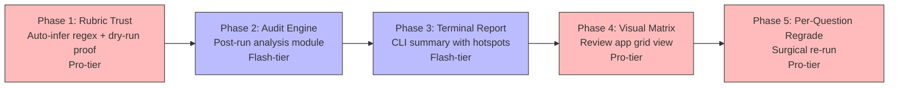

# Trust Loop & Visual Audit — Agent Delegation Prompts

These prompts build a **two-checkpoint grading workflow** where the human verifies the rubric upfront (with a live dry-run proof) and audits results visually after the batch completes. The system surfaces anomalies so the human reviews 3–5 hotspots, not 50 submissions.

> [!NOTE]
> **For agents reading this file**: Check `context.md` at the repo root for the current completion status of each phase before starting work. Phases marked `[x]` are done — skip them.

---

## Phasing & Dependencies



| Phase | Focus | Tier | What it delivers |
|---|---|---|---|
| **Phase 1** | Rubric Trust | Pro | Auto-infer `expected_answers` from solutions; 2-submission dry-run proof during rubric approval |
| **Phase 2** | Audit Engine | Flash | Post-run analysis module that computes pass rates, detects inconsistencies, and identifies hotspots |
| **Phase 3** | Terminal Report | Flash | Rich CLI summary with per-question pass-rate bars and curated hotspot list |
| **Phase 4** | Visual Matrix | Pro | New "Matrix" tab in the review web app: students × questions grid with confidence-weighted cells |
| **Phase 5** | Per-Question Regrade | Pro | Surgical regrade of a single question across all submissions without re-running the entire batch |

---

## 🤖 Phase 1: Rubric Trust — Auto-Infer Regex & Dry-Run Proof

**Principle**: *A human should never approve a rubric without seeing how it behaves on real student work. Deterministic answers should be auto-detected, not manually configured.*

**Recommended Agent**: Pro-tier

````markdown
You are a coding agent improving the rubric creation flow to make it maximally
trustworthy. Two changes: (1) auto-infer `expected_answers` regex patterns
from the solutions PDF, and (2) run a 2-submission dry-run during rubric
approval so the human sees live grading results before committing.

### Phase 1: Interactive Rubric Generation & Dry-Run (COMPLETED)

### Context

The rubric generation flow lives in `grader/workflow_cli.py` inside
`maybe_generate_rubric_with_ai()`. It calls `grader.generate_rubric_draft()`
in `grader/gemini_client.py`, which uses `build_rubric_draft_prompt()` to
instruct Gemini to produce a `DraftRubricConfig` JSON. The normalization
function `normalize_draft_rubric_payload()` cleans the output into a
YAML-compatible dict.

The `DraftRubricQuestion` Pydantic model already has an `expected_answers`
field. The rubric draft prompt (`build_rubric_draft_prompt()`) does NOT
currently instruct the model to populate it.

After the rubric is generated, `maybe_generate_rubric_with_ai()` shows a YAML
preview and offers Accept / Edit / Retry / Skip. There is no dry-run step.

### Instructions

**1. Update the rubric draft prompt to infer `expected_answers`**
- Open `grader/gemini_client.py`. Find `build_rubric_draft_prompt()`.
- Add the following instructions to the prompt text (in the "Rubric 
  construction rules" section):
  ```
  - For questions where the expected answer is a single numeric value,
    percentage, short formula, or brief token (e.g. "0.853", "493,557",
    "reject H0"), populate the expected_answers field with one or more
    regex patterns that would match a correct student answer. Use
    patterns like ["0\\.85[0-9]*"], ["493.*557"], or ["reject.*H0"].
    These patterns enable deterministic grading that bypasses the LLM
    entirely.
  - For open-ended, multi-sentence, or interpretive questions, leave
    expected_answers as an empty list []. Only populate it when a short,
    verifiable answer exists.
  - When constructing regex patterns, be tolerant of minor formatting
    differences: allow optional commas in numbers, optional percentage
    signs, and minor whitespace variations.
  ```

**2. Show inferred regex patterns during rubric preview**
- Open `grader/workflow_cli.py`. Find `maybe_generate_rubric_with_ai()`,
  specifically the `_print_yaml_preview()` helper and the section after
  `yaml_text = yaml.safe_dump(...)`.
- After calling `_print_yaml_preview(yaml_text)`, add a new section that
  scans the generated rubric payload's `questions` list and prints a
  compact summary of regex candidates:
  ```
  ── Regex Pre-check Candidates ──
  Q1: expected_answers = ["0\\.85[0-9]*"]  → deterministic ✓
  Q2: expected_answers = []                → LLM grading
  Q3: expected_answers = ["493.*557"]      → deterministic ✓
  ```
  Use `styled_info()` for each line. If all questions have empty
  `expected_answers`, print a single note: "No regex candidates inferred.
  All questions will use LLM grading."

**3. Add a 2-submission dry-run proof step**
- In `maybe_generate_rubric_with_ai()`, after the YAML preview and regex
  summary but BEFORE the Accept/Edit/Retry/Skip choice menu, add an
  optional dry-run step.
- The flow should be:
  1. Look for a `submissions_dir` path. It can be inferred from the
     `detected` context (the `DetectedConfig` that quickstart builds) or
     from the profile's `data/{profile}/submissions/` directory. If no
     submissions directory exists or is empty, skip the dry-run step
     silently.
  2. If submissions exist, pick up to 2 submission folders:
     - Sort folders by total file size (descending). Pick the largest
       (likely most complete) and the smallest (likely most sparse).
     - If only 1 folder exists, use it alone.
  3. Run grading on just those submissions using `--dry-run` mode. This
     means calling into the grading pipeline (the orchestrator's
     `run_grading_pipeline` or equivalent) with the draft rubric, the
     solutions PDF, and a `--student-filter` regex matching those 2
     folder names. Use `--dry-run` so no real output is written.
  4. For each graded submission, print a per-question verdict table:
     ```
     ── Dry-Run Proof: Jane Doe ──
     Q1: ✓ correct  (regex, confidence: 1.00)
         Answer: "R² = 0.853"
         Expected: regex "0\\.85[0-9]*"
     Q2: ✗ incorrect  (llm, confidence: 0.88)
         Answer: "The variation is explained"
         Reason: "Missing percentage value"
     ```
  5. If either dry-run submission fails (e.g., corrupted PDF), catch the
     exception, print a warning, and continue to the choice menu. Never
     block rubric approval on a dry-run failure.

**4. Restructure the choice menu**
- After the dry-run proof (or after the preview if dry-run was skipped),
  present the existing choices: Accept / Edit / Retry / Skip.
- No changes to the choice logic itself — only the ordering (dry-run
  results appear before the menu).

**5. Add tests**
- In `tests/test_workflow_cli.py`, add a test for the regex candidate
  summary: construct a rubric payload with some questions having
  `expected_answers` and some without. Assert the summary output contains
  the expected "deterministic ✓" and "LLM grading" labels.
- Add a test for `build_rubric_draft_prompt()`: assert that the returned
  prompt string contains the substring "expected_answers" and
  "deterministic".

**6. Verify**
```bash
PYTHONPATH=. .venv/bin/pytest tests/ -x -q
```

**7. Update status**
- Mark Phase 1 as `[x]` in `context.md`.
````

---

## 🤖 Phase 2: Audit Engine — Post-Run Analysis Module

**Principle**: *After a grading batch completes, the system should analyze the results and surface exactly where a human needs to look.*

**Recommended Agent**: Flash-tier

````markdown
You are a coding agent building a post-run analysis module that reads 
`grading_audit.csv` and produces a structured analysis with anomaly hotspots.

### Context

After grading, the pipeline writes `grading_audit.csv` to the output directory.
Each row has: folder, student_name, question_id, verdict, grading_source,
confidence, evidence_quote, band, percent, points, and error fields.

The review web app already has a `_build_outcomes_summary()` method in
`grader/review/api.py` that computes band_counts, verdict_counts, and
error_submissions. But it does NOT compute per-question pass rates,
inconsistency detection, borderline identification, or regex optimization
candidates.

### Instructions

**1. Create `grader/audit.py`**
- Create a new module `grader/audit.py` with a single public function:
  ```python
  def analyze_grading_audit(audit_csv_path: Path) -> AuditReport
  ```
- Define a frozen `@dataclass` called `AuditReport` with these fields:
  ```python
  @dataclass(frozen=True)
  class QuestionStats:
      question_id: str
      total: int
      correct: int        # includes rounding_error
      incorrect: int
      partial: int
      needs_review: int
      pass_rate: float    # (correct + partial * partial_credit) / total
      regex_count: int    # grading_source == "regex"
      llm_count: int      # grading_source == "llm"

  @dataclass(frozen=True)
  class Inconsistency:
      question_id: str
      evidence_a: str     # normalized evidence_quote from student A
      verdict_a: str
      student_a: str
      evidence_b: str
      verdict_b: str
      student_b: str

  @dataclass(frozen=True)
  class BorderlineStudent:
      student_name: str
      folder: str
      percent: float
      band: str
      next_band: str      # the band they almost reached
      gap: float          # how far from the threshold

  @dataclass(frozen=True)
  class RegexCandidate:
      question_id: str
      llm_correct_count: int   # LLM said correct but no regex match
      sample_answers: list[str]  # up to 3 evidence_quotes from LLM-correct

  @dataclass(frozen=True)
  class AuditReport:
      question_stats: list[QuestionStats]
      inconsistencies: list[Inconsistency]
      borderline_students: list[BorderlineStudent]
      regex_candidates: list[RegexCandidate]
      total_students: int
      total_questions: int
      band_counts: dict[str, int]
      error_students: list[str]  # folders with non-empty error field
  ```

**2. Implement `analyze_grading_audit()`**
- Read the CSV with `csv.DictReader`.
- Group rows by `folder` (student-level) and by `question_id`
  (question-level).

  **Per-question stats**: For each question_id, count verdicts and
  grading_sources. Compute pass_rate as:
  `(correct_count + rounding_error_count + partial_count * 0.5) / total`.

  **Inconsistency detection**: For each question_id, collect all
  `(evidence_quote, verdict)` pairs. Normalize evidence_quotes by
  lowercasing, stripping whitespace, and removing punctuation. Group by
  normalized quote. If the same normalized quote appears with DIFFERENT
  verdicts across different students, flag it as an `Inconsistency`.
  Cap at 10 inconsistencies total to avoid noise.

  **Borderline detection**: For each student (unique folder), get their
  `percent` and `band`. Compare against the rubric's band thresholds
  (which can be inferred from the audit data — find the minimum percent
  for each band). Flag students whose percent is within 5 percentage
  points of a higher band threshold.

  **Regex optimization candidates**: For each question_id, if
  `grading_source == "llm"` and `verdict == "correct"`, collect the
  evidence_quote. If 3+ students had LLM-correct verdicts for the same
  question, flag it as a `RegexCandidate` with sample answers. This
  helps the human write `expected_answers` patterns for future runs.

**3. Add tests**
- Create `tests/test_audit.py`.
- Test: CSV with 5 students, 3 questions, predictable verdicts → assert
  correct `pass_rate` values.
- Test: Two students with identical evidence_quotes but different verdicts
  → assert 1 `Inconsistency` detected.
- Test: Student at 89% with check_plus_min at 90% → assert 1
  `BorderlineStudent` with gap=1.0.
- Test: Question where all 5 students had LLM-correct → assert 1
  `RegexCandidate`.
- Test: empty CSV → assert empty `AuditReport` with zero counts.

**4. Verify**
```bash
PYTHONPATH=. .venv/bin/pytest tests/ -x -q
```

**5. Update status**
- Mark Phase 2 as `[x]` in `context.md`.
````

---

## 🤖 Phase 3: Terminal Report — CLI Summary with Hotspots

**Principle**: *The agent's post-run summary must be self-contained in the terminal. The human should be able to decide whether to approve, investigate, or re-run without opening a browser.*

**Recommended Agent**: Flash-tier

````markdown
You are a coding agent adding a rich terminal summary that prints after every
grading run, using the audit engine from Phase 2.

### Context

After grading completes, the orchestrator (`grader/orchestrator.py`) calls
`RunSummary` in `grader/ui.py` to print basic stats. The workflow CLI
(`grader/workflow_cli.py`) then initializes review state and starts the
review server.

Phase 2 created `grader/audit.py` with `analyze_grading_audit()` that returns
an `AuditReport` dataclass. This phase wires it into the post-run output.

### Instructions

**1. Create a terminal report renderer**
- Add a new function in `grader/ui.py`:
  ```python
  def print_audit_report(report: AuditReport, output_dir: Path) -> None
  ```
- This function prints a structured summary using Rich (with plain-text
  fallback for non-interactive terminals).

**2. Per-question pass-rate bars**
- For each `QuestionStats` in the report, print a horizontal bar:
  ```
  Q1   ████████████████████████████████████████ 100%  (regex: 45, llm: 0)
  Q2a  ██████████████████████████████░░░░░░░░░  71%  (regex: 0, llm: 45)
  Q2b  █████████████████████████░░░░░░░░░░░░░░  56%  (regex: 12, llm: 33)
  Q3   ███░░░░░░░░░░░░░░░░░░░░░░░░░░░░░░░░░░░   9%  (regex: 0, llm: 45)
  ```
- Use filled blocks (█) for pass rate and empty blocks (░) for the
  remainder. Total bar width = 40 characters.
- Color the bar green if pass_rate >= 70%, yellow if 40-70%, red if < 40%.
  (Use Rich markup if available, plain text otherwise.)
- After the question ID, right-align the percentage. After the bar, show
  the regex/llm split in parentheses.

**3. Hotspot summary**
- After the bars, print a "Human Review Checklist" section. Iterate
  through the AuditReport fields and emit warnings:

  - **High failure column**: Any question with pass_rate < 30%.
    ```
    ⚠  Q3: 9% pass rate (41/45 failed) — rubric may be too strict
    ```
  - **Inconsistencies**: If any `Inconsistency` objects exist:
    ```
    ⚠  2 inconsistencies: Q2b has similar answers graded differently
    ```
  - **REVIEW_REQUIRED students**: If `error_students` is non-empty:
    ```
    🔍 3 students flagged REVIEW_REQUIRED (OCR/PDF failures)
    ```
  - **Borderline students**: If `borderline_students` is non-empty:
    ```
    📊 2 students within 5% of next grade band
    ```
  - **Regex optimization**: If `regex_candidates` is non-empty:
    ```
    💡 Q1: 45 LLM-correct answers could be regex-matched
       Sample: "0.853", "0.85", ".853"
    ```

  If no hotspots exist, print: "✅ No anomalies detected."

**4. Band distribution line**
- Print a single-line summary:
  ```
  Bands: Check+ (8) | Check (22) | Check- (12) | Review (3)
  ```

**5. Wire into the grading pipeline**
- In `grader/orchestrator.py` (or `grader/workflow_cli.py` — whichever
  function runs after grading completes and writes the audit CSV), call:
  ```python
  from .audit import analyze_grading_audit
  from .ui import print_audit_report
  report = analyze_grading_audit(output_dir / "grading_audit.csv")
  print_audit_report(report, output_dir)
  ```
- Place this call AFTER `write_grading_audit_csv()` but BEFORE the
  review server starts.

**6. Add tests**
- In `tests/test_audit.py` (extending Phase 2 tests), add a test that
  calls `print_audit_report()` with a known `AuditReport` and captures
  stdout. Assert it contains the expected bar characters and hotspot
  keywords.

**7. Verify**
```bash
PYTHONPATH=. .venv/bin/pytest tests/ -x -q
```

**8. Update status**
- Mark Phase 3 as `[x]` in `context.md`.
````

---

## 🤖 Phase 4: Visual Matrix — Review App Grid View

**Principle**: *A human should see all students × all questions in a single color-coded grid where anomalies are immediately visible.*

**Recommended Agent**: Pro-tier

````markdown
You are a coding agent adding a "Matrix" tab to the review web app that shows
a students × questions grid with confidence-weighted, color-coded cells.

### Context

The review web app lives in `grader/review/static/` (index.html, app.js,
styles.css) and is served by `grader/review/server.py`. The API in
`grader/review/api.py` already exposes per-submission question data via
`list_submissions()` and `get_submission()`.

The `_build_outcomes_summary()` method returns band_counts and verdict_counts
but not per-question-per-student data in a matrix-friendly format.

### Instructions

**1. Add a matrix API endpoint**
- In `grader/review/api.py`, add a new method to `ReviewApi`:
  ```python
  def get_matrix(self) -> dict[str, Any]
  ```
  This returns:
  ```json
  {
    "question_ids": ["1", "2a", "2b", "3"],
    "students": [
      {
        "submission_id": "...",
        "student_name": "Alice Cooper",
        "folder": "123 - Alice Cooper",
        "band": "Check Plus",
        "percent": 95.0,
        "cells": {
          "1": {"verdict": "correct", "confidence": 1.0, "grading_source": "regex", "evidence_quote": "0.853"},
          "2a": {"verdict": "correct", "confidence": 0.92, "grading_source": "llm", "evidence_quote": "..."},
          "2b": {"verdict": "rounding_error", "confidence": 0.88, "grading_source": "llm", "evidence_quote": "..."},
          "3": {"verdict": "incorrect", "confidence": 0.95, "grading_source": "llm", "evidence_quote": "..."}
        }
      }
    ],
    "hotspots": { ... }  // output from analyze_grading_audit()
  }
  ```
  Build this by iterating over all submissions in the review state, extracting
  each question's `final` payload. Also call `analyze_grading_audit()` from
  Phase 2 and embed the hotspot data.

- In `grader/review/server.py`, add a route: `GET /api/matrix` → calls
  `api.get_matrix()`.

**2. Add the Matrix tab to the HTML**
- In `grader/review/static/index.html`, add a third tab button in the
  `tab-group` div: `<button id="tabMatrixBtn" type="button" class="tab-btn">Matrix</button>`.
- Add a new `<main id="matrixPanel" class="matrix-layout" style="display:none;">` 
  section below `reviewPanel`. This panel contains:
  - A `<div id="matrixToolbar">` with sort controls (sort by: name, percent,
    band) and a filter toggle (show all / show anomalies only).
  - A `<div id="matrixGrid" class="matrix-grid">` where the grid is
    rendered dynamically.
  - A `<div id="matrixDetail" class="matrix-detail">` sidebar that shows
    expanded information when a cell is clicked.

**3. Implement the matrix grid in app.js**
- Add a new state variable: `state.matrixData = null`.
- On tab switch to Matrix, fetch `/api/matrix` and render the grid.
- Grid rendering:
  - Header row: question IDs as column headers.
  - Each student row: student name (left-sticky), then one cell per question.
  - Cell rendering:
    - Background color by verdict: green (correct), lighter-green
      (rounding_error), yellow (partial), red (incorrect), orange
      (needs_review).
    - Opacity by confidence: `opacity = 0.4 + (confidence * 0.6)`. This
      means low-confidence verdicts appear washed out.
    - Icon by grading_source: 🧪 for regex, no icon for llm.
    - Cell text: verdict symbol (✓, ≈, ◐, ✗, ⟳).
  - Row background: light tint based on band.
  - Sortable: clicking column headers sorts by that question's verdict.

**4. Cell click → detail panel**
- When a cell is clicked, the right sidebar (`matrixDetail`) shows:
  - Student name and overall band/percent.
  - Question ID and verdict.
  - Evidence quote (what the student wrote).
  - LLM reasoning (logic_analysis field).
  - Grading source badge (regex / llm).
  - Confidence value.
  - A "Jump to Review" link that switches to the Review tab and loads
    that submission.

**5. Hotspot highlighting**
- Use the `hotspots` data from the API response.
- Column headers for questions with pass_rate < 30%: red glow border.
- Rows for borderline students: yellow left-border indicator.
- Cells involved in inconsistencies: pulsing border animation.

**6. Add matrix styles to styles.css**
- Grid layout using CSS Grid with sticky first column and header.
- Cell sizing: compact (e.g. 40×40px minimum) to fit many students.
- Responsive: horizontal scroll for many questions.
- Dark mode compatible (inherit existing app dark mode if any).

**7. Verify**
- Manual verification: run a grading batch, open the review app, switch
  to the Matrix tab. Verify all cells render correctly with proper colors
  and that clicking a cell shows the detail panel.
```bash
PYTHONPATH=. .venv/bin/pytest tests/ -x -q
```

**8. Update status**
- Mark Phase 4 as `[x]` in `context.md`.
````

---

## 🤖 Phase 5: Per-Question Regrade — Surgical Re-Run

**Principle**: *When the human sees a column of failures, they should be able to fix the rubric for that one question and re-run it across all students without touching the other questions.*

**Recommended Agent**: Pro-tier

````markdown
You are a coding agent adding per-question regrade capability. This allows a
human to change one question's rubric rules and re-run only that question
across all submissions, keeping all other question results intact.

### Context

The `regrade` command in `grader/workflow_cli.py` currently deletes cache
entries and re-runs the ENTIRE grading pipeline. There is no way to re-run
a single question.

The grading pipeline in `grader/orchestrator.py` processes each submission
as a unit: it sends the full rubric to the LLM and gets back results for
ALL questions. The results are cached per-submission (hash of rubric +
submission content).

Per-question regrade requires a different approach: instead of re-running the
LLM, we need to:
1. Load the existing cached results for each submission.
2. Remove the result for the target question.
3. Re-run grading for ONLY that question (either via regex precheck or LLM).
4. Merge the new result back into the existing results.
5. Re-score and re-annotate.

### Instructions

**1. Add a `--question` flag to the regrade command**
- In `grader/workflow_cli.py`, find the `regrade` argument parser (the
  function that sets up CLI args for the regrade subcommand).
- Add an optional `--question` flag (type=str) that accepts a question ID
  (e.g., `--question 3` or `--question 2b`).
- When `--question` is set, the regrade flow changes to per-question mode.

**2. Implement per-question regrade logic**
- Create a new function in `grader/orchestrator.py`:
  ```python
  def regrade_question(
      config: GradingConfig,
      question_id: str,
      ui: Any,
  ) -> list[SubmissionResult]
  ```
- This function:
  1. Discovers all submission units (same as normal grading).
  2. For each submission, loads the EXISTING cached grading result from
     the grading cache in `.grader_cache/cache.db`.
  3. Removes the `QuestionResult` entry matching `question_id`.
  4. Rebuilds a mini-rubric containing ONLY the target question.
  5. Runs the grading pipeline for just that one question:
     - First, try regex precheck against the target question's
       `expected_answers`.
     - If no regex match, send the mini-rubric to the LLM for just
       that question.
  6. Merges the new `QuestionResult` into the existing results list.
  7. Re-scores the full submission using `score_submission()` with the
     merged results.
  8. Re-annotates the PDF with the updated results.
  9. Updates the cache entry with the merged results.
  10. Returns the updated `SubmissionResult` list.

**3. Handle cache key stability**
- The current cache key is a hash of (rubric + submission content).
  Changing one question's rubric changes the hash, which invalidates the
  entire cache entry.
- For per-question regrade, the cache lookup must use the ORIGINAL cache
  key (before the rubric edit) to find existing results, then write the
  updated results under the NEW cache key.
- Add a helper function `compute_cache_key_for_submission()` that
  extracts the hashing logic. Call it twice: once with the old rubric
  (to read) and once with the new rubric (to write).

**4. Wire into the workflow CLI**
- In the regrade command handler, check if `--question` is set:
  - If set: call `regrade_question()` instead of the full pipeline.
  - If not set: existing full-regrade behavior (unchanged).
- After per-question regrade completes, re-run the audit analysis and
  print the terminal report (Phase 3).
- Then re-initialize review state and start the review server.

**5. Add tests**
- In `tests/test_orchestrator_errors.py` (or a new file
  `tests/test_regrade.py`):
  - Test: mock a cached result with 3 questions, call
    `regrade_question()` for question "2", assert that questions "1" and
    "3" retain their original verdicts and only question "2" is updated.
  - Test: per-question regrade with `--student-filter` set — assert only
    matching students are regraded.
  - Test: regrade a question that has `expected_answers` — assert the new
    result uses `grading_source="regex"` if the pattern matches.

**6. Update documentation**
- Update `README.md` regrade section to document the `--question` flag:
  ```bash
  # Regrade only Q3 across all students
  ./gradeline regrade --profile a2 --question 3

  # Regrade Q3 for specific students only
  ./gradeline regrade --profile a2 --question 3 --student-filter "Alice|Bob"
  ```

**7. Verify**
```bash
PYTHONPATH=. .venv/bin/pytest tests/ -x -q
```

**8. Update status**
- Mark Phase 5 as `[x]` in `context.md`.
````

---

## End-to-End Agent Script

After all 5 phases, a general-purpose agent (Codex, Claude Code, Agy) can
execute the full grading workflow with exactly two human checkpoints:

```bash
# Agent runs:
./gradeline import --profile midterm1
./gradeline quickstart --profile midterm1 --no-run

# → Checkpoint 1: Human sees rubric + regex candidates + 2-submission dry-run
# → Human: "Looks good" or "Loosen Q3, add regex for Q1"

./gradeline run --profile midterm1

# → Terminal prints audit report with pass-rate bars and hotspots
# → Checkpoint 2: Human reviews matrix in browser or reads terminal summary
# → Human: "Regrade Q3" or "Approve & export"

# If needed:
./gradeline regrade --profile midterm1 --question 3

# Final export:
# Human clicks Export in the review app, or:
# Agent reads brightspace_grades_import_reviewed.csv
```
