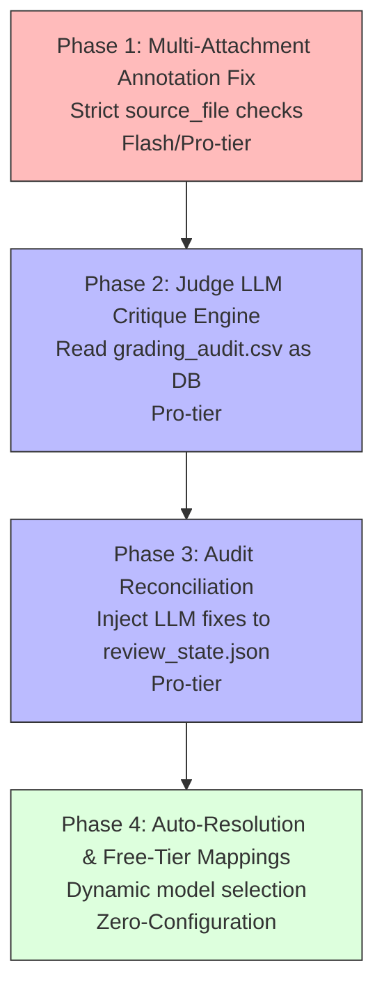

# Judge LLM Critique & Multi-Attachment Annotation Fixes

This plan establishes a reliable multi-attachment PDF annotation logic and introduces a "Judge LLM" workflow that treats `grading_audit.csv` as the source of truth for post-grading critique, ensuring perfect parity between the audit database, review server state, and Brightspace export.

---

## Phasing & Dependencies



| Phase | Focus | Tier | What it delivers |
|---|---|---|---|
| **Phase 1** | Multi-Attachment Annotation Fix | Flash | Fixes the bug where `find_anchor_in_doc` eagerly annotates the wrong PDF when multiple attachments are present. |
| **Phase 2** | Judge LLM Critique Engine | Pro | A module that ingests `grading_audit.csv` and prompts a Judge LLM to critique verdicts based on the logged `logic_analysis` and `evidence_quote`. |
| **Phase 3** | Audit Reconciliation | Pro | Inject Judge LLM fixes (verdict, reason) directly into `review_state.json` to maintain a single source of truth across the UI and Brightspace imports. |
| **Phase 4** | Auto-Resolution & Free-Tier | Free/Auto | Zero-brain model toggling (`auto`/`free` profiles) resolved via `defaults.toml`, matching exact Google GenAI free tier rate limits. |

---

## 🤖 Phase 1: Multi-Attachment Annotation Fix

**Principle**: *If an LLM specifically cites a source file for an answer, we should not eagerly use fallback text anchors on the wrong document.*

**Recommended Agent**: Flash-tier

### Instructions

1. **Modify `annotate_submission_pdfs` in `grader/annotate.py`**:
   - Inside the loop over `rubric.questions` (around line 76), before calling `resolve_model_location`, enforce a strict `source_file` check if there are multiple PDFs.
   - If `q_result.source_file` exists and does not match the current `pdf_path.name`, `continue` to the next question.
   - This prevents `find_anchor_in_doc` from incorrectly finding a fallback anchor (like "1)") on the wrong PDF. Unmatched questions will naturally fall into the `add_fallback_summary` logic at the end.

---

## 🤖 Phase 2: Judge LLM Critique Engine

**Principle**: *The `grading_audit.csv` contains the complete rationale for every grade. It acts as our database for a Judge LLM to review and identify grading mistakes.*

**Recommended Agent**: Pro-tier

### Instructions

1. **Create `grader/judge.py`**:
   - Implement a new CLI command or module `gradeline judge`.
   - It should load `grading_audit.csv` into a structured format (e.g., list of dicts).
   - Group the rows by `student_name`.
   - For each student, construct a prompt for the Judge LLM containing the Rubric for the question and the extracted row from `grading_audit.csv` (which includes `verdict`, `logic_analysis`, `evidence_quote`, and `detail_reason`).

2. **Define the Judge Output Schema**:
   - The LLM should return a JSON array validating the verdict for each question:
     ```json
     [
       {
         "question_id": "1",
         "critique": "The grader deducted points for X, but the evidence quote clearly shows X.",
         "proposed_verdict": "correct",
         "proposed_reason": "Corrected: Student included X.",
         "needs_fix": true
       }
     ]
     ```

---

## 🤖 Phase 3: Audit Reconciliation

**Principle**: *Critiques must be actionable and universally reflected. Injecting fixes into `review_state.json` guarantees that the Review UI, the audit DB, and the Brightspace import all share the same truth.*

**Recommended Agent**: Pro-tier

### Instructions

1. **Patching `review_state.json`**:
   - In `grader/judge.py`, after the Judge LLM generates critiques, open the `review_state.json` file for the grading run.
   - For every question where `"needs_fix": true`, inject the `critique` and `proposed_verdict` into the corresponding question block inside the state file.
   - Update the UI payload in `grader/review/api.py` and `app.js` to optionally highlight questions with a pending "Judge Critique" badge, allowing the instructor to see the proposed fix side-by-side with the original deduction.

---

## 🤖 Phase 4: Zero-Brain Auto-Resolution & Free-Tier Mappings

**Principle**: *The system must work out of the box. Setting model configurations to `"auto"` (standard tier) or `"free"` (free tier) resolves optimal models dynamically for each role without hardcoding model names in python logic.*

### Instructions

1. **Configure Mappings in `configs/defaults.toml`**:
   - Define default profiles in the config:
     ```toml
     [models.auto]
     grading = "gemini-2.5-flash"
     extraction = "gemini-2.5-flash"
     locator = ""
     rubric = "gemini-2.5-pro"
     judge = "gemini-2.5-pro"

     [models.free]
     grading = "gemini-2.5-flash-lite"
     extraction = "gemini-2.5-flash-lite"
     locator = ""
     rubric = "gemini-2.5-flash"
     judge = "gemini-2.5-flash"
     ```

2. **Implement Resolution Logic in `grader/defaults.py`**:
   - Add a resolver helper `resolve_model(role: str, setting: str) -> str`.
   - It reads the corresponding `[models.auto]` or `[models.free]` table when `setting` matches `"auto"` or `"free"`.
   - Default the default model definitions (`DEFAULT_MODEL`, etc.) to `"auto"`.

3. **Align `FREE_TIER_LIMITS` in `grader/rate_limit.py`**:
   - Adjust the limits to match the actual Google GenAI Free Tier constraints:
     - `gemini-2.5-flash`: 5 RPM, 20 RPD
     - `gemini-2.5-flash-lite`: 10 RPM, 20 RPD
     - `gemini-3-flash`: 5 RPM, 20 RPD

