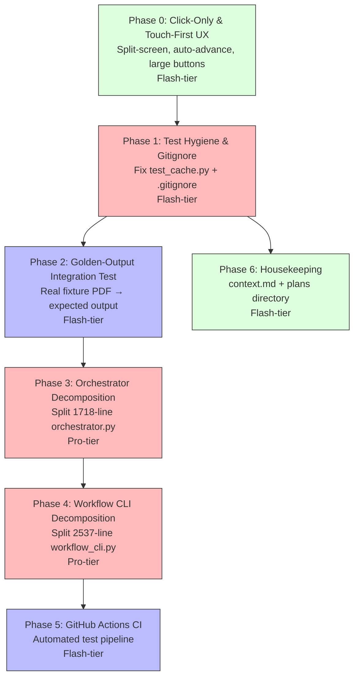

# Stability, Decomposition & CI — Gap Closure Plan

This plan closes the gaps identified in the July 11–15 sprint retrospective: broken test collection, missing integration coverage, module decomposition for the two largest files, CI automation, and housekeeping drift.

---

## Phasing & Dependencies



| Phase | Focus | Tier | What it delivers |
|---|---|---|---|
| **Phase 0** | Click-Only & Touch-First UX | Flash | Split-screen mobile layout, large verdict buttons, auto-advance toggle, and coordinate-aligned auto-scrolling. |
| **Phase 1** | Test Hygiene & Gitignore | Flash | Fix `test_cache.py` collection error; add `__pycache__/` and `*.pyc` to `.gitignore`; relocate the stray root-level test file into `tests/`. |
| **Phase 2** | Golden-Output Integration Test | Flash | A small fixture PDF with a known rubric that runs extraction → pre-check → scoring end-to-end and asserts deterministic output. |
| **Phase 3** | Orchestrator Decomposition | Pro | Split `orchestrator.py` (1718 lines) into `grading.py`, `preprocessing.py`, and keep `orchestrator.py` as a thin coordinator. |
| **Phase 4** | Workflow CLI Decomposition | Pro | Split `workflow_cli.py` (2537 lines) into `quickstart.py`, `import_cmd.py`, and `profile_utils.py` submodules. |
| **Phase 5** | GitHub Actions CI | Flash | `.github/workflows/test.yml` running the full test suite on push/PR with `.venv` caching and Playwright setup. |
| **Phase 6** | Housekeeping | Flash | Update `context.md` to reflect current state; reorganize `docs/plans/` with active vs. archive separation. |

---

## 🤖 Phase 0: Click-Only & Touch-First UX

**Principle**: *A grading review experience must be highly optimized for direct clicking and touch interaction, preventing endless scrolling or tedious multi-click workflows on mobile, tablet, and web.*

**Recommended Agent**: Flash-tier

### Instructions

1. **Split-Screen / Bottom-Sheet Mobile Layout**:
   - In `styles.css`, modify the responsive media query (`@media (max-width: 1180px)`) to use a split-screen or flexible sheet layout rather than stacking the panels into a single long vertical column.
   - Set the PDF viewer (`.viewer`) to have a fixed height (e.g., `55vh`) with `overflow: auto`.
   - Set the editing controls (`.editor`) to occupy the remaining height in a scrollable, touch-friendly panel (bottom-sheet) so that both the PDF and grade fields are simultaneously visible.

2. **One-Tap Verdict Buttons & Auto-Advance**:
   - In `index.html`, add a row of large, colorful, touch-friendly buttons for verdicts (`Correct`, `Rounding Error`, `Partial`, `Incorrect`, `Needs Review`) right next to or replacing the select element `#verdictSelect`.
   - Add an `Auto-Advance` toggle checkbox in the editor panel: `<input type="checkbox" id="autoAdvanceToggle" checked />`.
   - In `app.js`, when a verdict button or "Accept Judge Fix" is tapped/clicked:
     - Instantly save the verdict.
     - Automatically check/toggle `reviewed_final` to `true`.
     - If `Auto-Advance` is enabled, find the next card in the `#questionNavGrid` that is unresolved (verdict is `needs_review` or not marked reviewed) and programmatically trigger `selectQuestion(nextQId)`.

3. **Smooth Scroll to PDF Coordinates**:
   - In `app.js` (within `selectQuestion` and `renderMarker`), when a question is selected and has valid coordinates `[y, x]`:
     - Calculate pixel offsets `(px, py)` on the page image.
     - Scroll `ui.imageWrap` smoothly to center the marker:
       ```javascript
       ui.imageWrap.scrollTo({
         top: py - ui.imageWrap.clientHeight / 2,
         left: px - ui.imageWrap.clientWidth / 2,
         behavior: "smooth"
       });
       ```
     - Add a brief CSS keyframe scale/opacity pulse to `#marker` to highlight the location visually when selected.
     - Enhance touch targets for the marker dot (using `::after` padding) to allow easier finger-dragging on mobile/touch interfaces.

---

## 🤖 Phase 1: Test Hygiene & Gitignore

**Principle**: *A test suite that cannot collect is worse than no test suite — it silently hides regressions behind a collection error banner. Every test must be importable without side effects.*

**Recommended Agent**: Flash-tier

### Instructions

1. **Fix or relocate `test_cache.py`**:
   - The file [test_cache.py](file:///Users/walsh.kang/Documents/GitHub/gradeline/test_cache.py) is a scratch/debug script sitting at the **project root** (not inside `tests/`). It runs real API calls at import time (line 8: `GeminiGrader(api_key=os.environ.get("GEMINI_API_KEY", ""))`) which causes `ValueError: No API key` during `pytest` collection.
   - This is **not a proper test** — it's a one-off debug script with no assertions, no test functions, and hardcoded paths (`/Users/walsh.kang/Downloads/HW1 6-8 Solutions Summer 26.pdf`).
   - **Delete** the file and its `__pycache__/` sibling at the project root:
     ```bash
     rm test_cache.py
     rm -rf __pycache__/
     ```
   - If any useful logic from this script should be preserved (context cache key computation testing), create a proper test in `tests/test_context_cache.py` that:
     - Mocks `GeminiGrader.__init__` to avoid requiring a real API key.
     - Uses a small fixture rubric (not a hardcoded path).
     - Asserts that `compute_context_cache_key` returns a stable hash given the same inputs.

2. **Update `.gitignore`**:
   - Open [.gitignore](file:///Users/walsh.kang/Documents/GitHub/gradeline/.gitignore). Append:
     ```gitignore
     __pycache__/
     *.pyc
     *.pyo
     .pytest_cache/
     ```
   - Run `git rm -r --cached '*/__pycache__' '*.pyc' 2>/dev/null` to remove any already-tracked bytecode files from the index.

3. **Verify**:
   ```bash
   PYTHONPATH=. .venv/bin/pytest tests/ --co -q  # should show 0 errors during collection
   PYTHONPATH=. .venv/bin/pytest tests/ -x -q      # all tests pass
   ```

---

## 🤖 Phase 2: Golden-Output Integration Test

**Principle**: *Mock-only test suites prove the code does what you told it to do. A golden-output test with a real PDF proves the pipeline actually works end-to-end, catching regressions that no mock can detect.*

**Recommended Agent**: Flash-tier

### Instructions

1. **Create a minimal fixture PDF**:
   - Create `tests/fixtures/` directory.
   - Generate a small 1-page PDF programmatically using `reportlab` or `fpdf2` (add as a dev dependency in `requirements-dev.txt`) containing 3 clearly answerable questions with typed numeric answers:
     ```
     Q1) What is 2 + 2?  Answer: 4
     Q2) What is 10 * 5? Answer: 50
     Q3) What is 100 / 4? Answer: 25
     ```
   - Save as `tests/fixtures/sample_submission.pdf`.
   - Create a matching rubric `tests/fixtures/sample_rubric.yaml` with `expected_answers` patterns for all three questions (e.g., `["\\b4\\b"]`, `["\\b50\\b"]`, `["\\b25\\b"]`).
   - Create a matching solutions PDF `tests/fixtures/sample_solutions.pdf` (same content or summary).

2. **Create `tests/test_integration_golden.py`**:
   - Import `extract_pdf_text` from `grader.extract`, `regex_precheck` from `grader.precheck`, `score_submission` from `grader.score`, and `load_rubric` from `grader.config`.
   - Write a test `test_regex_precheck_golden_output`:
     - Load the fixture rubric.
     - Run `extract_pdf_text` on the fixture PDF.
     - Run `regex_precheck` over the extracted text against the rubric.
     - Assert all 3 questions return `grading_source="regex"` and `verdict="correct"`.
   - Write a test `test_scoring_golden_output`:
     - Build a `SubmissionResult` from the pre-check results.
     - Run `score_submission` and assert the final band is `CHECK_PLUS` (or the expected top band).
   - Write a test `test_annotation_golden_output`:
     - Run `annotate_submission_pdfs` on the fixture PDF with the pre-check results.
     - Assert the annotated PDF exists and is a valid PDF (non-zero size, parseable header).

3. **Skip condition for missing binaries**:
   - Guard tests that depend on `pdftoppm` or `tesseract` with `pytest.importorskip` or `shutil.which` checks so they skip gracefully in environments without system OCR tools.

4. **Verify**:
   ```bash
   PYTHONPATH=. .venv/bin/pytest tests/test_integration_golden.py -x -v
   ```

---

## 🤖 Phase 3: Orchestrator Decomposition

**Principle**: *A 1718-line file with 35 functions and 3 classes is a merge conflict factory. Each concern — grading logic, preprocessing/caching, and batch orchestration — should live in its own module with a clear API boundary.*

**Recommended Agent**: Pro-tier

> [!IMPORTANT]
> This is a **pure refactor** — no behavioral changes. Every existing test must continue to pass without modification. All imports from `grader.orchestrator` must remain valid (re-export from `__init__` or the orchestrator module itself).

### Instructions

1. **Extract `grader/grading.py`** (~350 lines):
   - Move from [orchestrator.py](file:///Users/walsh.kang/Documents/GitHub/gradeline/grader/orchestrator.py):
     - `grade_one_submission()` (line 321–633) — the core single-submission grading function
     - `collect_locator_candidates()` (line 663–699)
     - `apply_locator_candidates()` (line 700–737)
     - `build_annotation_progress_callback()` (line 634–645)
     - `build_grading_progress_callback()` (line 646–662)
   - These functions are stateless — they take a `GradingConfig` and return a `SubmissionResult`. They have no dependency on the `Orchestrator` class.
   - Update imports in `orchestrator.py` to use `from .grading import grade_one_submission, ...`.

2. **Extract `grader/preprocessing.py`** (~200 lines):
   - Move from `Orchestrator` class methods:
     - `compute_submission_pdf_hash()` (line 1340) → make it a standalone function accepting `pdf_paths: list[Path]`
     - `get_or_compute_preprocessing()` (line 1355) → standalone function accepting `(unit, config, cache_dir)`
     - `compute_cache_key_for_submission()` (line 1421) → standalone function accepting `(unit, rubric, config)`
   - Move related helpers:
     - `StageTiming` dataclass (line 136)
     - `SubmissionTelemetry` dataclass (line 146)
   - The `Orchestrator` class methods become thin wrappers calling the new module.

3. **Keep `orchestrator.py` as the coordinator** (~900 lines):
   - Retains: `GradingConfig`, `Orchestrator` class (with `.run()`, `.process_student()`, `.annotate_and_finish()`, `._conclude()`, `._shutdown_executors()`), `RollingSnapshot`, rolling snapshot helpers, `summarize_results()`.
   - Re-export moved symbols for backward compatibility:
     ```python
     # grader/orchestrator.py — backward compat
     from .grading import grade_one_submission, collect_locator_candidates, apply_locator_candidates
     from .preprocessing import compute_submission_pdf_hash, get_or_compute_preprocessing
     ```

4. **Update test imports**:
   - Grep all test files for `from grader.orchestrator import` and verify they still resolve through the re-exports.

5. **Verify**:
   ```bash
   PYTHONPATH=. .venv/bin/pytest tests/ -x -q
   ```

---

## 🤖 Phase 4: Workflow CLI Decomposition

**Principle**: *A 2537-line CLI module with 58 functions is unmaintainable. Quickstart logic, import logic, and profile management are independent domains that should be separately testable.*

**Recommended Agent**: Pro-tier

> [!IMPORTANT]
> Same rule as Phase 3: **pure refactor, no behavioral changes**. The `main()` entry point and all argparse subcommands must work identically. Re-export moved symbols from `workflow_cli.py` for backward compatibility.

### Instructions

1. **Create `grader/workflow/` package**:
   - Create `grader/workflow/__init__.py` that re-exports `main` and `build_parser` for backward compatibility.

2. **Extract `grader/workflow/quickstart.py`** (~500 lines):
   - Move from [workflow_cli.py](file:///Users/walsh.kang/Documents/GitHub/gradeline/grader/workflow_cli.py):
     - `quickstart_profile_interactive()` (line 1179)
     - `initialize_quickstart_state()` (line 1344)
     - `render_quickstart_summary()` (line 1380)
     - `format_quickstart_value()` (line 1400)
     - `edit_quickstart_field()` (line 1408)
     - `_do_edit_quickstart_field()` (line 1423)
     - `prompt_path_candidate()` (line 1471)
     - `prompt_text_candidate()` (line 1477)
     - `validate_quickstart_values()` (line 1642)
     - `must_path()`, `must_text()`, `must_port()` helpers (lines 1693–1711)
     - `maybe_generate_rubric_with_ai()` (line 1885)

3. **Extract `grader/workflow/import_cmd.py`** (~200 lines):
   - Move:
     - `import_assignment_assets()` (line 887)
     - `_find_brightspace_zip()` (line 1046)
     - `_extract_brightspace_zip()` (line 1083)

4. **Extract `grader/workflow/profile_utils.py`** (~200 lines):
   - Move:
     - `dedupe_paths()` (line 1712)
     - `dedupe_strings()` (line 1724)
     - `is_interactive_terminal()` (line 1739)
     - `toml_quote()` (line 2316)
     - `render_profile_toml()` (line 2321)
     - `build_grading_argv()` (line 2243)
     - `normalize_user_path()` (line 2267)
     - `parse_question_ids()` (line 2278)
     - `write_starter_rubric()` (line 2286)

5. **Keep `workflow_cli.py` as the CLI entry point** (~1200 lines):
   - Retains: `build_parser()`, `main()`, `interactive_command_menu()`, `run_from_profile()`, `regrade_from_profile()`, `serve_from_profile()`, and the argparse dispatch layer.
   - Imports from the new submodules.

6. **Backward compatibility**:
   - Add re-exports in `workflow_cli.py`:
     ```python
     from .workflow.quickstart import quickstart_profile_interactive, maybe_generate_rubric_with_ai
     from .workflow.import_cmd import import_assignment_assets
     from .workflow.profile_utils import build_grading_argv, normalize_user_path
     ```

7. **Verify**:
   ```bash
   PYTHONPATH=. .venv/bin/pytest tests/ -x -q
   ./gradeline --help  # CLI still works
   ```

---

## 🤖 Phase 5: GitHub Actions CI

**Principle**: *Tests that only run on a developer's laptop are documentation, not enforcement. A CI pipeline on every push turns the test suite into a gate.*

**Recommended Agent**: Flash-tier

### Instructions

1. **Create `.github/workflows/test.yml`**:
   ```yaml
   name: Tests
   on:
     push:
       branches: [main]
     pull_request:
       branches: [main]

   jobs:
     test:
       runs-on: ubuntu-latest
       strategy:
         matrix:
           python-version: ["3.12", "3.13", "3.14"]
       steps:
         - uses: actions/checkout@v4

         - name: Set up Python ${{ matrix.python-version }}
           uses: actions/setup-python@v5
           with:
             python-version: ${{ matrix.python-version }}

         - name: Cache pip packages
           uses: actions/cache@v4
           with:
             path: ~/.cache/pip
             key: ${{ runner.os }}-pip-${{ hashFiles('requirements.txt', 'requirements-dev.txt') }}

         - name: Install system dependencies
           run: |
             sudo apt-get update
             sudo apt-get install -y poppler-utils tesseract-ocr

         - name: Install Python dependencies
           run: |
             python -m pip install --upgrade pip
             pip install -r requirements.txt
             pip install -r requirements-dev.txt

         - name: Run unit tests
           env:
             GEMINI_API_KEY: "test-key-for-collection"
           run: |
             python -m pytest tests/ -x -q \
               --ignore=tests/test_review_ui.py \
               --tb=short

     e2e:
       runs-on: ubuntu-latest
       needs: test
       steps:
         - uses: actions/checkout@v4

         - name: Set up Python 3.13
           uses: actions/setup-python@v5
           with:
             python-version: "3.13"

         - name: Install dependencies
           run: |
             python -m pip install --upgrade pip
             pip install -r requirements.txt
             pip install -r requirements-dev.txt

         - name: Install Playwright browsers
           run: playwright install chromium --with-deps

         - name: Run E2E tests
           run: |
             python -m pytest tests/test_review_ui.py -v --tb=short
   ```

2. **Add a CI status badge to `README.md`**:
   - At the top of [README.md](file:///Users/walsh.kang/Documents/GitHub/gradeline/README.md), add:
     ```markdown
     
     ```

3. **Verify**:
   - Push to a branch and confirm the workflow runs green.

---

## 🤖 Phase 6: Housekeeping

**Principle**: *Stale tracking documents erode trust in the project's self-documentation. If the source of truth drifts from reality, developers stop reading it.*

**Recommended Agent**: Flash-tier

### Instructions

1. **Update `context.md`**:
   - Open [context.md](file:///Users/walsh.kang/Documents/GitHub/gradeline/context.md).
   - Move the following to **Completed**:
     - **Preprocessing & Pipeline Optimization**: All 3 phases shipped (Jul 14).
     - **Judge LLM Critique Engine**: All 4 phases shipped (Jul 15).
     - **Review Server UX Improvements (Phase 1–4)**: Phases 1–4 shipped (Jul 15). Phase 5 (CSS polish) is committed (commit `185b1aa`).
   - Update **Current Objective** to reflect the new focus: "Stabilization — closing test hygiene gaps, module decomposition, and CI automation."
   - If Phase 5 CSS polish is considered complete after commit `185b1aa`, update the Review Server UX entry to mark all 5 phases as done.

2. **Reorganize `docs/plans/`**:
   - Currently all plans live in `docs/plans/archive/` and `docs/plans/` itself is empty.
   - Move this plan (once approved and saved) into `docs/plans/stability-decomposition-ci.md` as the **active** plan.
   - Keep completed plans in `docs/plans/archive/`.
   - This establishes a clear convention: `docs/plans/` = active work, `docs/plans/archive/` = shipped work.

3. **Verify**:
   - Confirm `context.md` accurately reflects every workstream's status by cross-referencing against `git log --oneline --since="2026-07-11"`.
