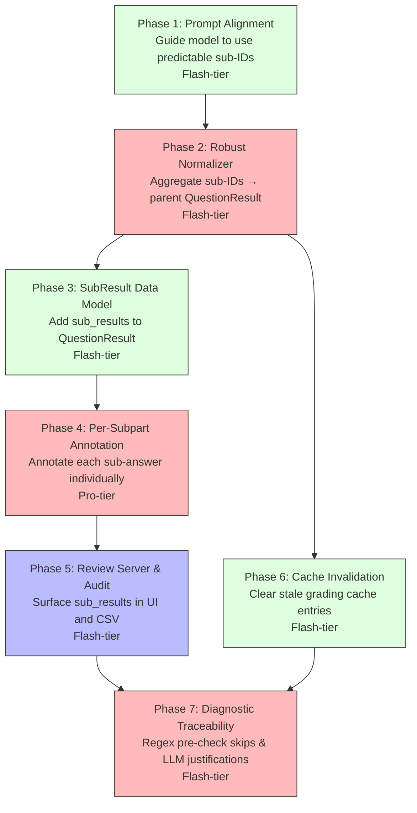

# Subpart Aggregation & Per-Answer Annotation Plan

When the rubric defines top-level question IDs (`"1"` through `"8"`) but the scoring rules describe multiple sub-parts (a, b, c…), the Gemini model often decomposes the response into sub-question IDs (`"1.1"`, `"4.a"`, `"6.Expected Return"`). The normalizer does a strict `question_map.get("1")` lookup, gets `None`, and flags the entire submission as `REVIEW_REQUIRED` with `confidence=0.0`.

This plan fixes that root cause, then builds on the fix to enable **per-subpart PDF annotations** — printing individual check/cross marks at the exact coordinates where each sub-answer was written, rather than a single consolidated mark per question.

---

## Phasing & Dependencies



| Phase | Focus | Tier | What it delivers |
|---|---|---|---|
| **Phase 1** | Prompt Alignment | Flash | Update system instruction and grading prompts to explicitly guide the model to use predictable sub-ID formats (`"1.a"`, `"1.b"`) when decomposing multi-part questions. |
| **Phase 2** | Robust Normalizer | Flash | Update `normalize_model_response` to fuzzy-match sub-question IDs to their parent rubric IDs and aggregate verdicts, with comprehensive unit tests. |
| **Phase 3** | SubResult Data Model | Flash | Add optional `sub_results` field to `QuestionResult` and wire it through serialization (report CSV, review state). |
| **Phase 4** | Per-Subpart Annotation | Pro | Update `annotate_submission_pdfs` to render individual marks at each sub-answer's coordinates instead of a single mark per question. |
| **Phase 5** | Review Server & Audit | Flash | Surface `sub_results` in the review server UI and grading audit CSV for transparency. |
| **Phase 6** | Cache Invalidation | Flash | Provide a mechanism to clear stale grading cache entries that contain the old (un-aggregated) model responses. |
| **Phase 7** | Diagnostic Traceability | Flash | Skip regex-prechecked questions during LLM grading, enforce LLM reasoning for `needs_review`, and surface detailed grading pipelines in audit logs. |

---

## 🤖 Phase 1: Prompt Alignment

**Principle**: *The cheapest bug to fix is the one you prevent. If we guide the model to decompose consistently, the normalizer has a clean, predictable input format.*

**Recommended Agent**: Flash-tier

### Instructions

1. **Update `build_context_system_instruction`** in `grader/gemini_client.py`:
   - After the existing `Block ID rule:` paragraph (around line 758), append a new paragraph:
     ```
     Sub-question rule: Some questions contain multiple sub-parts (e.g. a), b), c) or 1), 2), 3)).
     When you encounter such questions, you MUST return each sub-part as a separate entry in the
     questions array, with the id formatted as "{parent_id}.{subpart_label}" — for example "1.a",
     "1.b", "4.1", "4.2". The parent_id must exactly match one of the Expected question IDs.
     Never use prefixes like "Q1.a" or "Question 1a". Never omit the parent entry entirely in
     favor of only returning sub-parts — if you decompose, each sub-part id must start with the
     parent id followed by a dot separator.
     ```

2. **Update `build_unified_grading_prompt`** in `grader/gemini_client.py`:
   - After the `Expected question IDs: {labels}` line (line 665), add:
     ```
     If a question contains sub-parts, return each sub-part with id "{parent_id}.{subpart}" (e.g. "4.a", "4.b").
     ```

3. **Update `build_legacy_grading_prompt`** in `grader/gemini_client.py`:
   - Add the same sub-question instruction after the `No markdown fences. No extra fields.` line (line 613):
     ```
     If a question has sub-parts (a, b, c or 1, 2, 3), return each sub-part as a separate entry with id "{parent_id}.{subpart}".
     ```

4. **Update `build_agent_grading_prompt`** in `grader/gemini_client.py`:
   - Add the same instruction after the `Expected question IDs: {labels}` line (line 824):
     ```
     If a question has sub-parts, return each sub-part as a separate entry with id "{parent_id}.{subpart}".
     ```

5. **Verify**:
   - Confirm the test `test_prompts_include_numeric_equivalence_rule` still passes (it tests prompt content).
   - Add a new test `test_prompts_include_subpart_instruction` that asserts the substring `"sub-part"` or `"sub-parts"` appears in all four prompt builders.
   ```bash
   PYTHONPATH=. .venv/bin/pytest tests/test_gemini_contract.py -x -v -k "prompt"
   ```

---

## 🤖 Phase 2: Robust Normalizer

**Principle**: *Never trust the model to follow instructions perfectly. The normalizer must be robust enough to handle decomposed, prefixed, or reformatted question IDs without losing data or silently dropping verdicts.*

**Recommended Agent**: Flash-tier

> [!IMPORTANT]
> This phase is the **critical fix** for the REVIEW_REQUIRED flood. It must be landed first to unblock the current hw2 grading run. Phases 3–5 are enhancements that build on top.

### Instructions

1. **Add a new helper function `match_subparts_to_parent`** in `grader/gemini_client.py`, placed immediately above `normalize_model_response`:

   ```python
   def match_subparts_to_parent(parent_id: str, raw_id: str) -> bool:
       """Return True if raw_id is a sub-part of parent_id.

       Matches patterns like:
         parent="1" → "1.a", "1.b", "1.1", "1_a", "1a"
         parent="4" → "4.a", "4.b", "4.1", "q4.a", "Q4.b"

       Does NOT match:
         parent="1" → "10", "10.a", "11", "12"  (different parent)
       """
       parent = parent_id.strip().lower()
       raw = raw_id.strip().lower()

       # Strip common prefixes: "q", "q.", "question", "question "
       for prefix in ("question ", "question", "q.", "q"):
           if raw.startswith(prefix):
               raw = raw[len(prefix):].lstrip()
               break

       if raw == parent:
           return True  # Exact match (not a sub-part, but a direct hit)

       # Check if raw starts with parent followed by a non-digit separator
       if not raw.startswith(parent):
           return False

       remainder = raw[len(parent):]
       if not remainder:
           return False

       # The first character after parent_id must be a non-digit separator
       # to avoid matching parent="1" to raw="10" or "12"
       first_char = remainder[0]
       return first_char in ('.', '_', '-', ' ') or first_char.isalpha()
   ```

2. **Add a new helper function `aggregate_subpart_verdicts`** immediately after `match_subparts_to_parent`:

   ```python
   def aggregate_subpart_verdicts(sub_verdicts: list[str]) -> str:
       """Aggregate multiple sub-part verdicts into a single parent verdict.

       Rules (ordered by priority):
       - If ANY sub-part is needs_review → needs_review
       - If ALL are correct → correct
       - If ALL are correct or rounding_error (with ≥1 rounding_error) → rounding_error
       - If ALL are incorrect → incorrect
       - Otherwise → partial
       """
       if not sub_verdicts:
           return "needs_review"

       verdict_set = set(sub_verdicts)

       if "needs_review" in verdict_set:
           return "needs_review"
       if verdict_set == {"correct"}:
           return "correct"
       if verdict_set <= {"correct", "rounding_error"}:
           return "rounding_error"
       if verdict_set == {"incorrect"}:
           return "incorrect"
       return "partial"
   ```

3. **Modify `normalize_model_response`** in `grader/gemini_client.py`:
   - After the `question_map` is built, add a second pass that groups sub-question IDs under their parent:
     ```python
     # Group sub-question IDs under their rubric parent ID
     parent_subparts: dict[str, list[JsonDict]] = {}
     for question in rubric.questions:
         parent_id = question.id.strip().lower()
         if parent_id in question_map:
             continue  # Direct match exists, no need to search sub-parts
         subs = []
         for raw_id, raw_item in question_map.items():
             if match_subparts_to_parent(parent_id, raw_id):
                 subs.append(raw_item)
         if subs:
             parent_subparts[parent_id] = subs
     ```
   - In the main loop over `rubric.questions`, change the `raw = question_map.get(question.id)` lookup to:
     ```python
     raw = question_map.get(question.id)
     sub_items = parent_subparts.get(question.id.strip().lower())

     if raw is None and sub_items is None:
         # No match at all — flag for review
         normalized_questions.append(
             QuestionResult(
                 id=question.id,
                 verdict="needs_review",
                 confidence=0.0,
                 logic_analysis="",
                 short_reason="",
                 detail_reason="",
                 evidence_quote="",
             )
         )
         continue

     if raw is not None and sub_items is None:
         # Direct match — process as before (existing code for lines 882–910)
         ...
         continue

     if raw is None and sub_items is not None:
         # Sub-part aggregation path
         sub_verdicts = [normalize_verdict(s.get("verdict")) for s in sub_items]
         aggregated_verdict = aggregate_subpart_verdicts(sub_verdicts)
         aggregated_confidence = min(
             normalize_confidence(s.get("confidence")) for s in sub_items
         )

         # Build logic_analysis by concatenating sub-part analyses
         analysis_parts = []
         for s in sub_items:
             sid = str(s.get("id", "")).strip()
             analysis = str(s.get("logic_analysis", "")).strip()
             if analysis:
                 analysis_parts.append(f"[{sid}] {analysis}")
         aggregated_logic = "\n".join(analysis_parts)

         # Pick short_reason from the first failing sub-part
         first_failing = next(
             (s for s in sub_items if normalize_verdict(s.get("verdict")) not in ("correct", "rounding_error")),
             sub_items[0],
         )
         raw_short = str(first_failing.get("short_reason", "")).strip()[:500]
         raw_detail = str(first_failing.get("detail_reason", "")).strip()[:900]
         short_reason, detail_reason = normalize_feedback(
             verdict=aggregated_verdict,
             raw_short_reason=raw_short,
             raw_detail_reason=raw_detail,
             fallback_fail_note=question.short_note_fail,
         )

         # Pick coords from the first failing sub-part (or first sub-part)
         coord_source = first_failing
         coords = parse_coords_0_to_1000(coord_source.get("coords"))
         page_number = parse_page_number(coord_source.get("page_number") or coord_source.get("page"))
         source_file = str(coord_source.get("source_file", "")).strip() or None
         block_id = str(coord_source.get("block_id", "")).strip() or None

         # Evidence: concatenate from all sub-parts
         evidence_parts = [str(s.get("evidence_quote", "")).strip() for s in sub_items if s.get("evidence_quote")]
         evidence_quote = " | ".join(evidence_parts)[:500]

         normalized_questions.append(
             QuestionResult(
                 id=question.id,
                 verdict=aggregated_verdict,
                 confidence=aggregated_confidence,
                 logic_analysis=aggregated_logic,
                 short_reason=short_reason,
                 detail_reason=detail_reason,
                 evidence_quote=evidence_quote,
                 coords=coords,
                 page_number=page_number,
                 source_file=source_file,
                 block_id=block_id,
             )
         )
         continue

     # Both raw AND sub_items exist (unlikely but possible) — prefer direct match
     # Process raw as before (existing code for lines 882–910)
     ...
     ```

4. **Add comprehensive tests** in `tests/test_gemini_contract.py`:

   ```python
   class SubpartAggregationTests(unittest.TestCase):
       """Tests for match_subparts_to_parent and aggregate_subpart_verdicts."""

       def test_match_subparts_dot_format(self):
           self.assertTrue(match_subparts_to_parent("1", "1.a"))
           self.assertTrue(match_subparts_to_parent("1", "1.b"))
           self.assertTrue(match_subparts_to_parent("4", "4.1"))

       def test_match_subparts_letter_suffix(self):
           self.assertTrue(match_subparts_to_parent("4", "4a"))
           self.assertTrue(match_subparts_to_parent("4", "4b"))

       def test_match_subparts_q_prefix(self):
           self.assertTrue(match_subparts_to_parent("1", "Q1.a"))
           self.assertTrue(match_subparts_to_parent("1", "q1.b"))

       def test_no_match_different_parent(self):
           self.assertFalse(match_subparts_to_parent("1", "10"))
           self.assertFalse(match_subparts_to_parent("1", "10.a"))
           self.assertFalse(match_subparts_to_parent("1", "12"))
           self.assertFalse(match_subparts_to_parent("1", "11"))

       def test_no_match_unrelated(self):
           self.assertFalse(match_subparts_to_parent("1", "2"))
           self.assertFalse(match_subparts_to_parent("1", "abc"))

       def test_aggregate_all_correct(self):
           self.assertEqual(aggregate_subpart_verdicts(["correct", "correct"]), "correct")

       def test_aggregate_mixed_needs_review(self):
           self.assertEqual(aggregate_subpart_verdicts(["correct", "needs_review"]), "needs_review")

       def test_aggregate_rounding_error(self):
           self.assertEqual(aggregate_subpart_verdicts(["correct", "rounding_error"]), "rounding_error")

       def test_aggregate_partial_mix(self):
           self.assertEqual(aggregate_subpart_verdicts(["correct", "incorrect"]), "partial")

       def test_aggregate_all_incorrect(self):
           self.assertEqual(aggregate_subpart_verdicts(["incorrect", "incorrect"]), "incorrect")

       def test_normalize_response_aggregates_subparts(self):
           """Full integration: model returns "1.1" and "1.2" but not "1"."""
           rubric = RubricConfig(
               assignment_id="test",
               bands={"check_plus_min": 0.9, "check_min": 0.7},
               questions=[
                   QuestionRubric(
                       id="1", label_patterns=["1)"], scoring_rules="",
                       short_note_pass="ok", short_note_fail="check",
                   ),
                   QuestionRubric(
                       id="2", label_patterns=["2)"], scoring_rules="",
                       short_note_pass="ok", short_note_fail="check",
                   ),
               ],
           )
           payload = {
               "student_submission_id": "x",
               "questions": [
                   {"id": "1.1", "verdict": "correct", "confidence": 0.95,
                    "logic_analysis": "Part 1", "short_reason": "", "evidence_quote": "e1",
                    "coords": [100, 200], "page_number": 1, "source_file": "a.pdf"},
                   {"id": "1.2", "verdict": "incorrect", "confidence": 0.85,
                    "logic_analysis": "Part 2", "short_reason": "Wrong formula",
                    "evidence_quote": "e2", "coords": [300, 400], "page_number": 1},
                   {"id": "2", "verdict": "correct", "confidence": 0.9,
                    "short_reason": "", "evidence_quote": "e3"},
               ],
               "global_flags": [],
           }
           normalized = normalize_model_response(payload, rubric)
           by_id = {q.id: q for q in normalized["questions"]}

           # Q1 should aggregate to "partial" (one correct, one incorrect)
           self.assertEqual(by_id["1"].verdict, "partial")
           self.assertEqual(by_id["1"].confidence, 0.85)
           self.assertIn("[1.1]", by_id["1"].logic_analysis)
           self.assertIn("[1.2]", by_id["1"].logic_analysis)

           # Q2 should remain a direct match
           self.assertEqual(by_id["2"].verdict, "correct")

       def test_normalize_response_does_not_match_10_to_1(self):
           """Ensure parent="1" does not grab "10" or "10.a"."""
           rubric = RubricConfig(
               assignment_id="test",
               bands={"check_plus_min": 0.9, "check_min": 0.7},
               questions=[
                   QuestionRubric(
                       id="1", label_patterns=["1)"], scoring_rules="",
                       short_note_pass="ok", short_note_fail="check",
                   ),
               ],
           )
           payload = {
               "student_submission_id": "x",
               "questions": [
                   {"id": "10", "verdict": "correct", "confidence": 0.9,
                    "short_reason": "", "evidence_quote": ""},
               ],
               "global_flags": [],
           }
           normalized = normalize_model_response(payload, rubric)
           by_id = {q.id: q for q in normalized["questions"]}
           # Q1 should be needs_review (10 is NOT a subpart of 1)
           self.assertEqual(by_id["1"].verdict, "needs_review")
   ```

5. **Verify**:
   ```bash
   PYTHONPATH=. .venv/bin/pytest tests/test_gemini_contract.py -x -v
   ```

---

## 🤖 Phase 3: SubResult Data Model

**Principle**: *Aggregated verdicts lose information. By attaching the original sub-part results to the parent, downstream consumers (annotation, review UI, audit) can access per-subpart coordinates, verdicts, and feedback without re-parsing.*

**Recommended Agent**: Flash-tier

### Instructions

1. **Add `sub_results` field to `QuestionResult`** in `grader/types.py`:
   ```python
   @dataclass(frozen=True)
   class QuestionResult:
       id: str
       verdict: str
       confidence: float
       short_reason: str
       evidence_quote: str
       logic_analysis: str = ""
       detail_reason: str = ""
       coords: tuple[float, float] | None = None
       page_number: int | None = None
       source_file: str | None = None
       placement_source: str | None = None
       block_id: str | None = None
       grading_source: str = "llm"
       sub_results: tuple["QuestionResult", ...] | None = None  # Subpart breakdown
   ```

2. **Update the aggregation path in `normalize_model_response`**:
   - After building the aggregated `QuestionResult`, also build individual sub-part `QuestionResult` objects and attach them:
     ```python
     sub_question_results = []
     for s in sub_items:
         sub_qr = QuestionResult(
             id=str(s.get("id", "")).strip(),
             verdict=normalize_verdict(s.get("verdict")),
             confidence=normalize_confidence(s.get("confidence")),
             logic_analysis=str(s.get("logic_analysis", "")).strip(),
             short_reason=str(s.get("short_reason", "")).strip()[:500],
             detail_reason=str(s.get("detail_reason", "")).strip()[:900],
             evidence_quote=str(s.get("evidence_quote", "")).strip()[:500],
             coords=parse_coords_0_to_1000(s.get("coords")),
             page_number=parse_page_number(s.get("page_number") or s.get("page")),
             source_file=str(s.get("source_file", "")).strip() or None,
             block_id=str(s.get("block_id", "")).strip() or None,
         )
         sub_question_results.append(sub_qr)

     normalized_questions.append(
         QuestionResult(
             ...
             sub_results=tuple(sub_question_results) if sub_question_results else None,
         )
     )
     ```

3. **Update `question_result_to_payload`** in `grader/review/types.py`:
   - Add serialization for `sub_results`:
     ```python
     def question_result_to_payload(result: QuestionResult) -> dict[str, Any]:
         payload = {
             ...existing fields...
         }
         if result.sub_results:
             payload["sub_results"] = [question_result_to_payload(sr) for sr in result.sub_results]
         return payload
     ```

4. **Update `question_result_from_payload`** in `grader/review/types.py`:
   - Add deserialization for `sub_results`:
     ```python
     sub_results_raw = payload.get("sub_results")
     sub_results = None
     if isinstance(sub_results_raw, list) and sub_results_raw:
         sub_results = tuple(
             question_result_from_payload(sr.get("id", ""), sr)
             for sr in sub_results_raw
             if isinstance(sr, dict)
         )
     return QuestionResult(
         ...existing fields...
         sub_results=sub_results,
     )
     ```

5. **Verify**:
   ```bash
   PYTHONPATH=. .venv/bin/pytest tests/ -x -q
   ```

---

## 🤖 Phase 4: Per-Subpart Annotation

**Principle**: *A mark placed directly next to a wrong sub-answer is worth ten marks placed at the question header. The student should see exactly where they went wrong without hunting through the PDF.*

**Recommended Agent**: Pro-tier

> [!IMPORTANT]
> This is the most complex phase. It modifies the core annotation rendering loop in `annotate_submission_pdfs`. The agent must be careful to preserve backward compatibility: questions without `sub_results` must continue to render exactly as before.

### Instructions

1. **Update `mark_text_for_result` to accept an optional sub-part label** in `grader/annotate.py`:
   ```python
   def mark_text_for_result(question_id: str, result: QuestionResult, *, subpart_label: str | None = None) -> str:
       display_id = f"{question_id}.{subpart_label}" if subpart_label else question_id
       if result.verdict == "correct":
           return f"✓ Q{display_id}"
       if result.verdict == "rounding_error":
           return f"✓ Q{display_id} ≈"
       reason = compact_reason(result.short_reason, max_chars=42)
       if reason:
           return f"x Q{display_id}: {reason}"
       return f"x Q{display_id}"
   ```

2. **Update `annotate_submission_pdfs`** in `grader/annotate.py`:
   - In the inner loop over `rubric.questions`, after resolving the question's `q_result`, check whether `q_result.sub_results` is populated:

   ```python
   if q_result.sub_results and len(q_result.sub_results) > 1:
       # Render individual marks for each sub-part
       any_rendered = False
       for sub_result in q_result.sub_results:
           # Extract the subpart label from the sub_result id
           # e.g., "4.a" → subpart_label="a", "1.2" → subpart_label="2"
           subpart_label = sub_result.id
           if subpart_label.lower().startswith(question.id.lower()):
               subpart_label = subpart_label[len(question.id):].lstrip("._- ")
           subpart_label = subpart_label or sub_result.id

           sub_model_location = resolve_model_location(
               doc=doc,
               pdf_filename=pdf_path.name,
               result=sub_result,
               block_registry=block_registry,
               ignore_source_file=single_pdf,
           )

           if sub_model_location is not None:
               if len(sub_model_location) == 3:
                   sub_page_idx, sub_point, sub_norm_coords = sub_model_location
               else:
                   sub_page_idx, sub_point, sub_norm_coords, _ = sub_model_location

               sub_mark_text = mark_text_for_result(
                   question_id=question.id,
                   result=sub_result,
                   subpart_label=subpart_label,
               )
               # Use slightly smaller font for sub-part marks to reduce clutter
               sub_fontsize = max(8.0, question_fontsize * 0.85)
               insert_mark(
                   doc[sub_page_idx],
                   sub_point,
                   mark_text=sub_mark_text,
                   is_correct=(sub_result.verdict in ("correct", "rounding_error")),
                   question_id=f"{question.id}.{subpart_label}",
                   fontsize=sub_fontsize,
               )
               any_rendered = True
           # If sub-part has no coords, skip it — the parent fallback handles it

       if any_rendered:
           rendered.add(question.id)  # Mark entire question as rendered
           # Record placement for the first sub-part with valid coords for audit
           for sub_result in q_result.sub_results:
               if sub_result.coords is not None:
                   placement_details[question.id] = {
                       "placement_source": "subpart_model_coords",
                       "source_file": sub_result.source_file or pdf_path.name,
                       "page_number": sub_result.page_number,
                       "coords": sub_result.coords,
                   }
                   break
           continue  # Skip the regular single-mark path
   ```

3. **Update tests** in `tests/test_annotate_and_locator.py`:
   - Add a test `test_subpart_annotation_renders_multiple_marks` that:
     - Creates a `QuestionResult` with two `sub_results`, each having different coords.
     - Calls `annotate_submission_pdfs` and asserts that two separate annotations are rendered on the PDF.
   - Add a test `test_no_subresults_renders_single_mark` confirming backward compatibility.

4. **Verify**:
   ```bash
   PYTHONPATH=. .venv/bin/pytest tests/test_annotate_and_locator.py tests/test_annotate_editable_fields.py -x -v
   ```

---

## 🤖 Phase 5: Review Server & Audit

**Principle**: *Every verdict must be traceable. If the normalizer aggregated sub-parts into a "partial" verdict, the reviewer needs to see which sub-parts passed and which failed — without digging into raw JSON.*

**Recommended Agent**: Flash-tier

### Instructions

1. **Update `write_grading_audit_csv`** in `grader/report.py`:
   - After writing the parent question row, if `q.sub_results` is not None, write additional rows for each sub-part. Use the sub-result's own ID as `question_id` and prefix `grading_source` with `"sub_"` to distinguish them from parent rows:
     ```python
     for q in result.question_results:
         writer.writerow([...])  # existing parent row
         if q.sub_results:
             for sub in q.sub_results:
                 writer.writerow([
                     str(result.submission.folder_relpath),
                     result.submission.student_name,
                     len(result.submission.pdf_paths),
                     pdf_relpaths,
                     "",  # percent not meaningful for sub-parts
                     "",  # band not meaningful for sub-parts
                     "",  # points not meaningful for sub-parts
                     sub.id,
                     sub.verdict,
                     f"sub_{sub.grading_source}",
                     f"{sub.confidence:.2f}",
                     sub.logic_analysis,
                     sub.short_reason,
                     sub.detail_reason,
                     sub.evidence_quote,
                     sub.source_file or "",
                     sub.page_number if sub.page_number is not None else "",
                     f"{sub.coords[0]:.2f}" if sub.coords else "",
                     f"{sub.coords[1]:.2f}" if sub.coords else "",
                     sub.placement_source or "",
                     "",
                 ])
     ```

2. **Update the review server question detail panel** in `grader/review/static/app.js`:
   - In the function that renders the question detail (verdict, confidence, reasons), check if the question payload has a `sub_results` array.
   - If present, render a collapsible "Sub-parts" section below the aggregated verdict showing each sub-part's ID, verdict (with color), and short_reason.
   - Each sub-part row should be clickable to navigate to its coordinates/page in the PDF viewer.

3. **Update the review API `get_submission` endpoint** in `grader/review/api.py`:
   - Ensure `sub_results` is included in the question payload when present in the review state JSON. Since `question_result_to_payload` already serializes it, this should flow automatically — but verify with a test.

4. **Verify**:
   ```bash
   PYTHONPATH=. .venv/bin/pytest tests/test_report_csv.py tests/test_review_api.py -x -v
   ```

---

## 🤖 Phase 6: Cache Invalidation

**Principle**: *The grading cache stores raw model JSON payloads keyed by submission + rubric hash. After updating prompts (Phase 1), old cached responses still contain the decomposed sub-IDs without the new prompt guidance. A regrade must bypass or clear these stale entries.*

**Recommended Agent**: Flash-tier

### Instructions

1. **Increment `PROMPT_VERSION`** in `grader/gemini_client.py`:
   - Change from `"2026-04-18-gemini-placement-v5"` to `"2026-07-15-subpart-aggregation-v6"`.
   - Verify that `PROMPT_VERSION` is included in all cache key computations (`compute_grade_cache_key`, `compute_unified_grade_cache_key`, `compute_agent_grade_cache_key`). If it is **not**, add it to each hash computation.

2. **Delete stale context caches**:
   - Add a CLI flag `--clear-cache` to `./gradeline regrade` that deletes all rows from the `grading_cache` and `context_cache` tables in `cache.db` before starting the run.

3. **Verify**:
   ```bash
   PYTHONPATH=. .venv/bin/pytest tests/test_gemini_contract.py -x -v -k "cache_key"
   ./gradeline regrade --profile hw2 --clear-cache
   ```

---

## 🤖 Phase 7: Diagnostic Traceability

**Principle**: *If a submission drops to manual review, we must know exactly why. Furthermore, the LLM should not waste tokens and time grading questions that already confidently passed the deterministic regex pre-check.*

**Recommended Agent**: Flash-tier

### Instructions

1. **Optimize Pre-check Pipeline (`grader/orchestrator.py`)**:
   - In `grade_one_submission`, modify the grading flow so that questions already passed by `regex_precheck` are excluded from the LLM prompt.
   - When calling `grader.grade_submission` and `grader.grade_submission_unified`, filter the `rubric.questions` list passed to the grader to omit those in `prechecked_results`.
   - Update `build_unified_grading_prompt` and `build_legacy_grading_prompt` to accept a filtered list of questions instead of extracting them from the full `rubric`.

2. **Enforce `needs_review` Justifications (`grader/gemini_client.py`)**:
   - In `build_context_system_instruction`, modify the rule:
     ```python
     "If uncertain, set verdict=needs_review and confidence near 0.0. You MUST provide a short_reason explaining exactly why the student's work cannot be confidently graded.\n"
     ```
   - In `normalize_model_response`, ensure that if the LLM provides a `short_reason` for a `needs_review` verdict, that reason is preserved and not overwritten by a generic normalizer fallback.

3. **Enhance Audit Traceability (`grader/report.py` and `grader/types.py`)**:
   - Add a `diagnostics_trace` (list of strings) or ensure `grading_source` strictly differentiates `regex` vs `llm`. 
   - Ensure the audit CSV explicitly logs `regex` vs `llm` in the `grading_source` column (which it does, but verify any aggregated sub-parts don't lose the LLM justification).

4. **Verify**:
   ```bash
   PYTHONPATH=. .venv/bin/pytest tests/test_precheck.py tests/test_report_csv.py tests/test_orchestrator.py -x -v
   ```

---

## Verification Checklist

After all phases are complete:

```bash
# 1. Full test suite passes
PYTHONPATH=. .venv/bin/pytest tests/ -x -q --ignore=tests/test_review_ui.py

# 2. Regrade hw2 with fresh cache
./gradeline regrade --profile hw2 --clear-cache

# 3. Verify REVIEW_REQUIRED count dropped significantly
# In the terminal output, count the ⟳ symbols — should be near zero for questions
# that previously had sub-part decomposition issues (Q1, Q4, Q6).

# 4. Verify PDF annotations show per-subpart marks
# Open an annotated PDF for a submission where Q4 has sub-parts (a, b, c, d)
# and confirm individual marks appear at the coordinates of each sub-answer.

# 5. Review server shows sub-parts
./gradeline serve --profile hw2
# Navigate to a submission, click on Q4, and verify the sub-parts panel appears.
```
